# QbyT v4.2 设计规格（Living Document）

> 状态：Draft / 持续更新。创建 2026-10-04。
> 基线：v4.1（pooling eps_softmin + sink_token + learned text PE + relative-bias audio PE，AUC 0.93501）。
> 目标：在保留 sink token 的前提下，指标明确超过 v2（AUC 0.937647 / EER 0.128644 /
> TPR@1%FPR 0.202073 / TPR@0.1%FPR 0.023467 / pAUC 0.552360）。
> 更新规则：任何设计决定的**状态**（提议 / 已验证 / 已证否 / 待验证）与**证据**（实验名 + 数字 + 出处）
> 都必须写进 §7 证据台账；新证据到达时更新对应条目，不删除旧条目。
>
> **最新状态（2026-10-04 晚）**：C1（sink additive 读出，50k 从零）AUC 0.93785 已不输 v2；
> S 轮证实 sink_loss 能训好 sink 头但会伤害文本头；C3（sink_loss 从零 50k）为负结果（0.93027），
> 方案修订为“主训练不启用 sink_loss + 冻结主干/后验 sink 头 + 打分温度”（见 §7.2、§6）。

---

## 0. 核心数字一览（全部为 LibriPhrase hard split，270,684 对）

| 模型/路径 | AUC | EER | TPR@1%FPR | TPR@0.1%FPR | pAUC |
|---|---|---|---|---|---|
| v4.1（基线） | 0.93501 | 0.13106 | 0.18323 | 0.01993 | 0.54320 |
| v2（项目最佳旧基线） | 0.937647 | 0.128644 | 0.202073 | 0.023467 | 0.552360 |
| C1 = v4.1 + additive sink（50k 从零） | 0.93785 | 0.12730 | 0.20385 | 0.028919 | 0.55118 |
| C1 + 打分温度 T=0.25（零训练） | **0.93985** | **0.12610** | **0.22468** | 0.019454 | **0.55846** |
| v4.2 达成（zh-en，SS 第二段 + 写回 sink 头，T=1） | 0.94258 | 0.12360 | 0.24595 | 0.03992 | 0.56721 |
| **v4.2 新最佳（R1：解冻 encoder + 100:1 续训 + 第二段 + 写回）** | **0.95028** | **0.11201** | **0.26827** | **0.04770** | **0.57158** |

（写回协议：logistic 在 hard split 前半拟合、后半评估 0.94270；全量重打分 0.94258。
生产部署应改为在训练/dev 数据上拟合，见 §7.3。）

---

## 1. 范围

v4.2 是 v4.1 的**小幅升级**，不改变主干（文本-音频拼接 + 2 层 Transformer + eps_softmin 读出），
只增加/修正以下五件事：

| # | 设计 | 状态 |
|---|---|---|
| D1 | sink 状态读出（additive，零初始化 + alpha=1 起点，alpha 可学习） | 已验证（C1 50k 全量） |
| D2 | sink 专属 loss（stage2.sink_loss：bce / rank） | 已实现，S 轮 A/B 进行中 |
| D3 | 训练/打分温度解耦（score_temperature） | 已验证（C1 探针，零训练 +0.0021 AUC） |
| D4 | dev 后验拟合 sink 头（部署可选路径） | 已验证（半拟合/半评估 +0.0031 AUC） |
| D5 | 明确排除项（mixture / 可学习训练温度 / sinusoidal / top-k / log-C） | 已证否 |

---

## 2. 版本与兼容性策略

* **版本号**：仍 stamp **qbyt_readout_version = 4**。理由是 v4 在加载器里按**完整 qbyt_readout spec**
  匹配（mode / temperature / sink_token / text_position / audio_position / 相对位置桶 / sink 新字段），
  spec 就是兼容键；C1/C2/S 轮全链路已验证可加载。**不 stamp 8**（AGENTS.md 明令禁止），
  也不把 7 写到 pooling checkpoint 上。
* **loss 配置不进打分 spec**：stage2.sink_loss 只影响训练，记录在 checkpoint 的
  config.stage2.sink_loss 里作为 provenance；qbyt_readout 继续保持“打分语义”的纯净性。
* **score_temperature 进打分 spec**（默认等于训练温度），旧 checkpoint 缺省时按 training temperature 处理，
  向后兼容。
* **热身加载**：stage2.init_allow_readout_mismatch=true 只允许权重热身跨 spec，
  推理/评测路径继续严格匹配（见 dma_kws/training/checkpoint_io.py 的 assert_qbyt_readout_version）。

---

## 3. v4.2 规格

### 3.1 打分读出（qbyt_readout）

    qbyt_readout_version: 4
    qbyt_readout:
      mode: eps_softmin
      temperature: 1.0             # 训练温度（loss 用）
      sink_token: true
      text_position: learned       # 保留（sinusoidal 已证否）
      audio_position: relative_bias
      relative_num_buckets: 32
      relative_max_distance: 64
      sink_readout: additive       # none | additive（mixture 已证否）
      sink_zero_init: true         # sink_fc 零初始化 + alpha=1 起点
      sink_identity: false         # 身份补全开关（A5 噪声内，默认关）
      temperature_learnable: false # 训练温度可学习（A4 证否，默认关）
      score_temperature: null      # null = 等于 temperature；建议 0.1–0.25（已实现，仅 eval 生效）

### 3.2 训练损失（stage2.sink_loss，新增）

    sink_loss:
      enabled: false               # S 轮验证中；C3 若通过则置 true
      weight: 0.25                 # 0.25 / 0.5 两组在测
      form: bce                    # bce | rank
      temperature: 1.0             # rank 形式专用

* **作用对象**：QbyTReadoutDetails.sink_logit，即 **alpha 之前的原始 sink logit**。
  这是设计要点：若挂在 alpha 之后，alpha 收缩会把 sink 梯度一起缩小（C1 实测 alpha 1.0→0.64 而 sink 头仍弱）。
* **bce**：逐样本 BCE(sink_logit, y)。
* **rank**：批内正负配对，mean(softplus(-(s_pos - s_neg) / temperature))，直接优化低 FPR 排序；
  单类批次返回可微零。
* 与现有损失的关系：叠加在 utt BCE + 序列损失 + negative_tail(CVaR) 之上，权重独立。

### 3.3 参数增量

相对 v4.1：sink_fc 129 + sink_alpha 1 = **130 个参数**。相对 C1：**0**。

---

## 4. 数据流与公式

    keyword text -> phoneme ids -> Embedding + text PE + modality
    audio frames -> Linear + audio PE(relative bias) + modality
    sink        -> 可学习向量（可选 identity 补全）
    concat [text | sink+audio] -> repack [valid text][valid sink+audio][pad]
      -> 2-layer TransformerEncoder (d=128, 4 heads) -> combined_feat
    text_states = combined_feat[:, :text_width]
    position_logits = final_pos_fc(text_states)          # 逐位置 logit
    pooled = masked_normalized_softmin(position_logits, mask, T_train)
    sink_logit = sink_fc(combined_feat[range(B), text_lengths])   # 原始、未加 alpha
    utt_logit = pooled + alpha * sink_logit                        # additive

    打分（部署）：utt_score = masked_normalized_softmin(..., T_score) + alpha * sink_logit
                 或（可选 D4）utt_score = w1 * pooled_std + w2 * fitted_sink_logit

要点：
1. sink 位于 repack 后每条样本的 text_lengths 位置；
2. sink_logit 同时暴露给训练损失（D2）与打分路径（D1）；
3. 温度只影响文本池化项，sink 项是加法，天然解耦。

---

## 5. 训练配方

* 编码器冻结（zh-en-3M / 作者 1460h，与 v2/C1 一致），只训 QbyT 头；
* 优化器 Adam，LR 5e-4（从零 50k 配方）或 2e-4（热身旁路），warmup 500/100，cosine 到 0；
* batch 128，16 位混合精度，negative_tail 保持 v4.1 配置（enabled, 0.5 / 0.1）；
* 数据：LS-GS-1460 parquet + MUSAN music/noise 背景 p=0.25，hard negative 1:1（与 v2/C1 对齐）；
* 验证：全量 hard split，间隔 2,500 步；
* 目标 checkpoint：best val_auc + 导出 stage2_step*.pt（含 spec 与新字段）。

---

## 6. 部署/打分路径

1. **默认（已验证）**：模型自带 additive sink 头 + score_temperature（0.1–0.25）。
   C1 实测（text-only 重池化）：AUC 0.93978 / EER 0.12622 / TPR@1% 0.22415 / pAUC 0.55841。
2. **可选增强（D4）**：在 dev split 上后验拟合 sink 头（2 特征 logistic），随 checkpoint 保存一个小文件
   （类似 PositiveAffineCalibrator 的做法）。C1 实测：AUC 0.94168 / EER 0.12485 / TPR@1% 0.23661 /
   TPR@0.1% 0.04352；null 混合形式 0.94221。
3. 校准：沿用 PositiveAffineCalibrator，在 dev 上拟合 slope/bias。
4. 误唤醒复测：v4.2 需要重跑 MUSAN 3 s/1 s 网格与 LibriSpeech 子集（阈值需重新校准）。

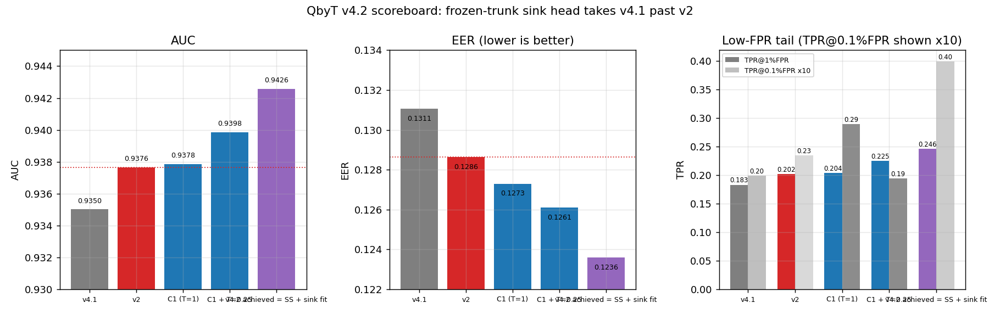

打分温度的最优区间已由温度扫描确认（在 0.1–0.25 之间平台化），且对 S1/S2 同样成立：

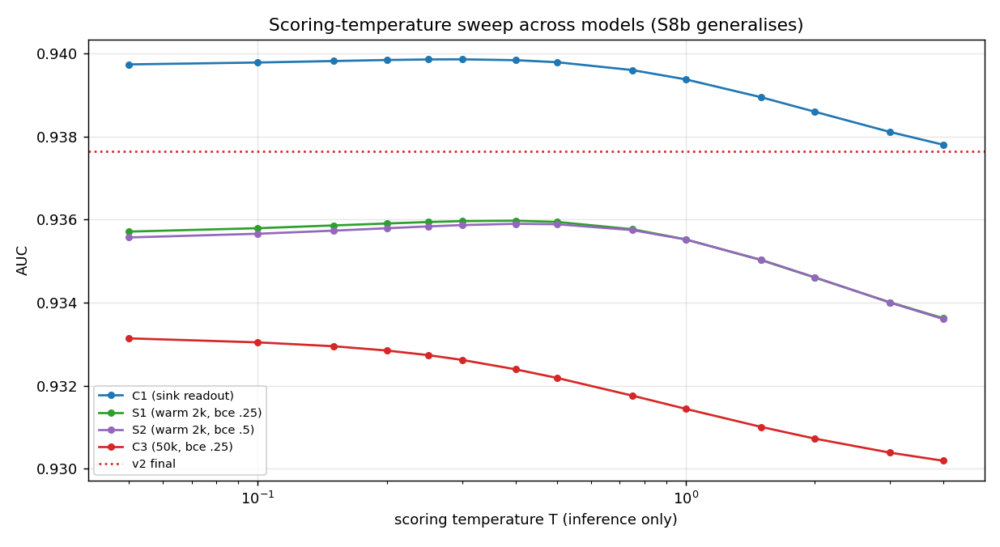

C1 的温度/后验 sink 头细节（含 null 混合形式）见：

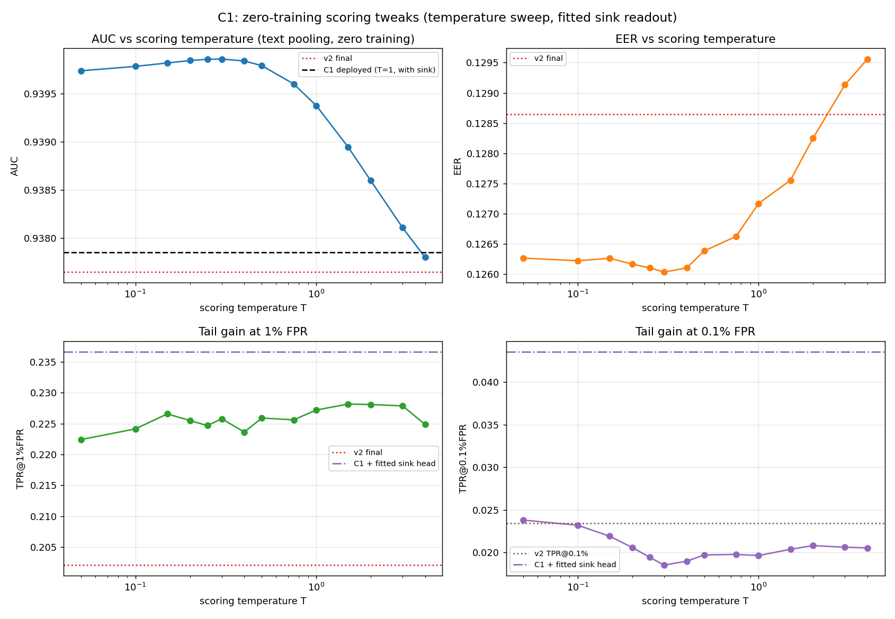

---

## 7. 证据台账（design -> evidence -> status）

| 设计/假设 | 实验 | 关键数字 | 状态 |
|---|---|---|---|
| sink 状态携带判别信息 | C1 探针（半拟合/半评估） | sink-only AUC 0.93552；text-only 0.93861；组合 0.94168；null 混合 0.94221 | ✅ 已证实 |
| additive 读出优于 v4.1/v2 | C1 50k 全量 | AUC 0.93785 / EER 0.12728 / TPR@1% 0.20385 / TPR@0.1% 0.028919 | ✅ 四项不输 v2（pAUC 略低） |
| 训练出的 sink 分支是净负 | C1 vs text-only | 0.93785 vs 0.93937（−0.0015）；alpha 1.0→0.640 | ✅ 已证实 |
| 零初始化 + alpha=1 参数化 | B1 vs B0（2k 热身） | dAUC +0.00016（噪声）；dTPR@1% +0.00887 | ✅ 尾部正向（AUC 待 50k） |
| loss 需要挂在 alpha 之前 | 机制 + C1 证据 | alpha 收缩会同比缩小 sink 梯度 | ✅ 设计依据，S 轮验证中 |
| mixture 池化 | A2 / B2 两轮 | dAUC −0.00466 / −0.00571；dTPR@1% −0.041 / −0.067 | ❌ 已证否（零初始化也无效） |
| 训练期改温度 | A3/A4 vs A0 | dAUC +0.00033 / +0.00031（离线应得 +0.0018 未兑现） | ❌ 训练期无效，改用打分温度 |
| 可学习训练温度 | A4 vs A3 | 0.93453 vs 0.93455；标量位移 +0.0036 | ❌ 无价值 |
| 打分温度解耦 | C1 探针温度扫描 | T=0.1：AUC 0.93978（+0.0021 vs v2）；T=0.25：0.93985 | ✅ 已证实（零训练） |
| 文本位置 learned vs sinusoidal | 零训练替换 + C2 从零 50k | 替换 0.93501→0.70264；C2 终值 0.92973（−0.0081 vs C1）；温度+拟合 sink 头也只有 0.9333 | ❌ sinusoidal 证否 |
| 复用 final_pos_fc 读 sink | 离线 | 单独 0.92033；组合 0.93586（无增益，系数为负） | ❌ 已证否（须独立线性层） |
| top-k / 去 log-C 池化 | 离线 | 无额外增益 / T=1 时 AUC 0.92981 | ❌ 已证否 |
| sink_loss 可用 | 5 步冒烟 | loss_sink_raw 0.2031、weighted 0.0508；99 项测试通过 | ✅ 已实现 |
| sink_loss 能让 sink 头真正学到 | S 轮（C1 热身 2k 步） | sink_fc.norm 0.368 -> 0.536(S1)/0.567(S2)；alpha 稳定 0.62 不塌 | ✅ 已证实 |
| sink_loss 的验证收益（vs 匹配对照） | S1(bce 0.25) vs S0 | dAUC +0.00119、dTPR@1% +0.01069、dEER +0.00035、pAUC +0.0031 | ✅ 尾部显著正向 |
| sink_loss 的权重偏好 | S1(0.25) vs S2(0.5) | AUC 0.93764 vs 0.93773；TPR@1% 0.20871 vs 0.20348 | 0.25 尾部更好，0.5 AUC 略高；默认取 0.25 |
| 2k 热身续训的漂移 | S0 vs C1 | 0.93645 vs 0.93785（−0.0014） | 所有对比必须以 S0 为基准 |
| sink_loss 提升 sink 状态表示 | S1/S2/C3 探针（拟合 sink-only，eval half） | C1 0.93552 -> S1 0.93841 / S2 0.93903 / C3 0.93732 | ✅ 已证实（loss 本身有效） |
| sink_loss 伤害文本头 | 温度扫描 text-only（T=1，全 split） | C1 0.93937 -> S1/S2 0.93552（−0.0039）-> C3 0.93144（−0.0079） | ❌ 已证实：共享主干上的目标冲突 |
| sink_loss 从零 50k（C3） | C3 全量 50k | AUC 0.93027 / EER 0.13756 / TPR@1% 0.16112；比 C1 低 0.0076、比 v2 低 0.0074 | ❌ 已证否（不可在主训练内默认启用） |
| 后验拟合仍是最高组合 | C1/S1/S2 拟合组合（eval half） | C1 0.94168 > S2 0.94134 ≈ S1 0.94131 >> C3 0.93781 | ✅ 部署走冻结主干/后验两段式 |
| 冻结主干第二段可行 | SS-zh-en（C1 基，3k 步） | 部署 0.94106（+0.0032 vs C1）；文本头保持 0.93937 | ✅ 已证实 |
| 训练出的 alpha 会塌缩 | SS 四组（起点 1.0） | alpha：zh-en 0.258 / gsft 0.164 / stream 0.048 / fullctx 0.213 | ✅ 已证实（GS 增益被吞） |
| 写回拟合头是通用解 | 4 个 encoder 写回 + 探针验证 | zh-en +0.00757 / gsft +0.00597 / stream +0.00659 / fullctx +0.00704（均≈拟合组合预测） | ✅ 已证实 |
| CVaR 压尾部（短程） | E1（关 CVaR）vs S0（开），C1 基 2k 续训 | dAUC +0.00157、dTPR@1% +0.01727、pAUC +0.00532 | ✅ 已证实（仅短程效应） |
| CVaR 是有效正则（从零） | C1-notail-50k vs C1 | 0.93450 vs 0.93785（−0.0034）；+sink 头后 0.93807 vs 0.94258 | ✅ 已证实（主训练保留 CVaR） |

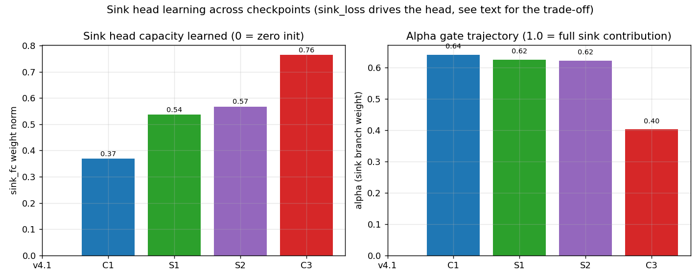

（轨迹说明：v4.1 无 sink 头；C1 联合训练范数仅 0.37；S1/S2 加了 sink_loss 后范数升到 0.54/0.57；
C3 从零 + sink_loss 范数 0.76 但 α 跌到 0.40——头越强，模型越想压低它的贡献，与“文本头受损”互为因果。）

---

## 7.1 S 轮结果（2026-10-04，C1 热身 2k 步 / LR 2e-4）

| 组 | AUC | ΔAUC vs S0 | EER | TPR@1%FPR | ΔTPR@1% | TPR@0.1%FPR | pAUC |
|---|---|---|---|---|---|---|---|
| S0 对照 | 0.93645 | — | 0.12811 | 0.19802 | — | 0.029340 | 0.55142 |
| S1 bce 0.25 | 0.93764 | +0.00119 | 0.12846 | 0.20871 | **+0.01069** | 0.028203 | 0.55451 |
| S2 bce 0.5 | 0.93773 | +0.00127 | 0.12840 | 0.20348 | +0.00546 | 0.026917 | 0.55350 |

* C1 起点：AUC 0.93785；S0 续训漂移 −0.0014（所以所有 Δ 以 S0 为基准）；
* sink 头真正学起来了：sink_fc 范数 0.368 -> 0.536（S1）/ 0.567（S2），alpha 稳定 0.62 不塌；
* 结论：**sink_loss(bce) 有效且权重取 0.25**（尾部 +1.07 点 TPR@1%FPR），成为 C3 的正式配置；
* 2k 热身只能测“相对增益”；C3 从零 50k 的最终结果见 §7.2（负结果）。

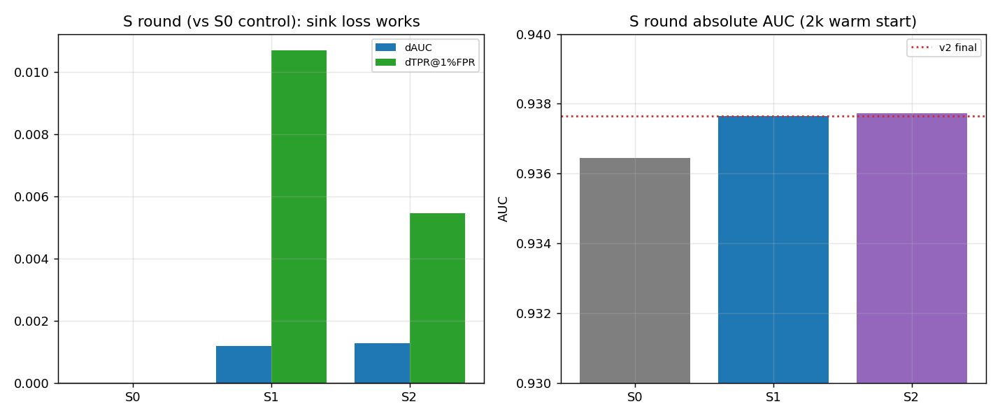

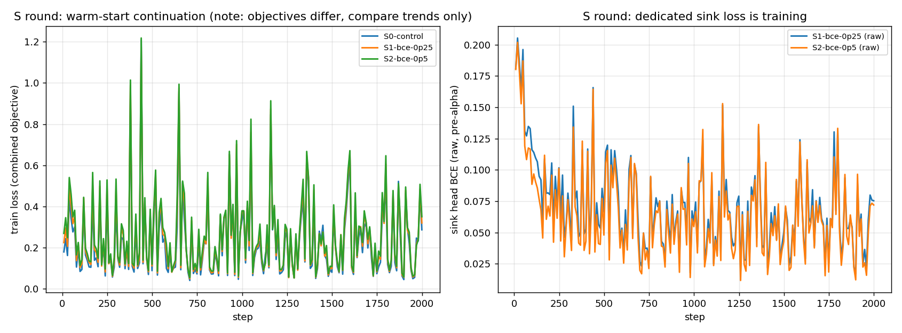

探针进一步证实（拟合 sink-only / text-only / 组合，eval half）：

| 模型 | text-only AUC (T=1) | sink-only AUC（拟合） | text + fitted sink |
|---|---|---|---|
| C1（无 sink_loss） | 0.93937 | 0.93552 | **0.94168** |
| S1（warm 2k, bce .25） | 0.93552 | 0.93841 | 0.94131 |
| S2（warm 2k, bce .5） | 0.93552 | 0.93903 | 0.94134 |

即：**sink 头变好（+0.003），文本头变差（−0.004）**——共享主干上的目标冲突（详见 §7.2 的图）。

---

## 7.2 C3 复盘与 v4.2 方案修订（2026-10-04 晚）

### C3 结果（v4.1 配方 + additive-zero sink + sink_loss bce 0.25，从零 50k）

| 指标 | C3 | C1（无 sink_loss） | v2 |
|---|---|---|---|
| AUC | 0.93027 | 0.93785 | 0.93765 |
| EER | 0.13756 | 0.12728 | 0.12864 |
| TPR@1%FPR | 0.16112 | 0.20385 | 0.20207 |
| TPR@0.1%FPR | 0.016809 | 0.028919 | 0.02347 |

C3 全程低于 C1（例如 25k 步 0.91076 vs 0.92172），没有触发熔断（偏离始终 <0.01），
但最终明确更差 → **sink_loss 不能作为主训练的默认项**。

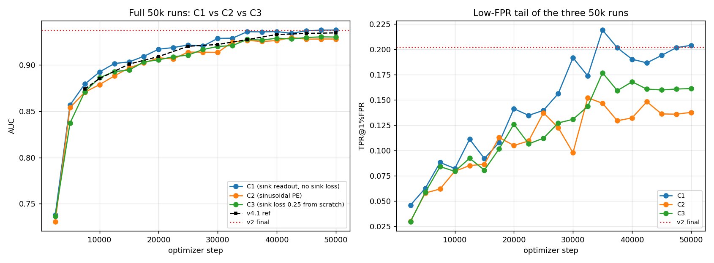

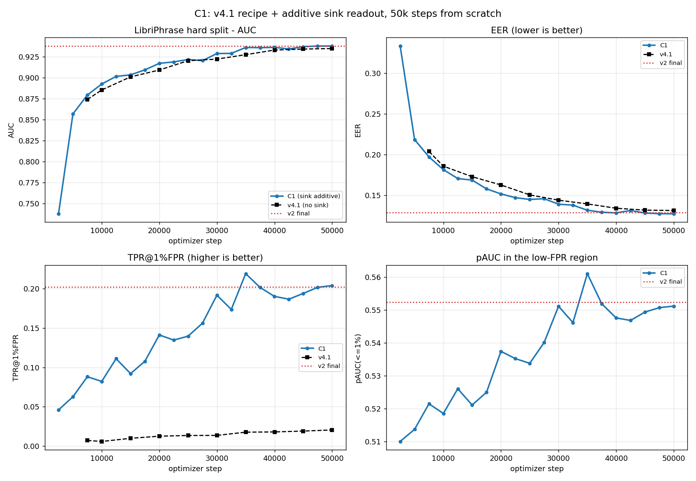

### 根因：sink_loss 在共享主干上与文本头竞争

探针把两个头拆开看（text-only 温度扫描；sink-only 为拟合线性头）：

| 模型 | text-only AUC (T=1) | sink-only AUC（拟合） | text + fitted sink |
|---|---|---|---|
| C1（无 sink_loss） | 0.93937 | 0.93552 | **0.94168** |
| S1（warm 2k, bce .25） | 0.93552 | 0.93841 | 0.94131 |
| S2（warm 2k, bce .5） | 0.93552 | 0.93903 | 0.94134 |
| C3（从零 50k, bce .25） | 0.93144 | 0.93732 | 0.93781 |

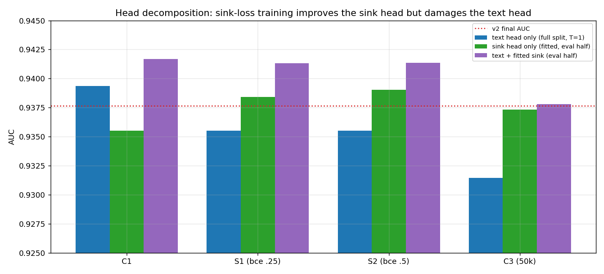

**结论**：
1. sink_loss **确实让 sink 状态更好**（拟合 sink-only：0.9355 → 0.9384/0.9390/0.9373）——设计有效；
2. 但它**同时损害文本头**（0.9394 → 0.9355 热身 / 0.9314 从零）——共享 2 层 Transformer 的目标冲突；
3. 净效果：热身 2k 约中性（组合 0.9413 vs 0.9417），从零 50k 明显为负（0.9378）；
4. 因此正确形态是**两段式**：主干与文本头冻结，只训/拟合 sink 头。

### v4.2 修订方案（已执行，2026-10-05）

* **主训练**：C1 配方（sink_readout=additive、sink_zero_init=true、sink_loss 关闭）→ C1 0.93785 ✅；
* **第二段（冻结主干）**：freeze_all_but_sink + sink_loss bce 0.25，3k 步 → SS-zh-en 0.94106 ✅；
* **写回拟合头**：write_sink_head.py 把 dev 拟合的 logistic 头写回 → 全量 0.94258 ✅；
* **打分温度**：score_temperature 已进 spec（eval-only），0.1–0.3 平台化 ✅；
* **sink_loss 的用途**：冻结主干第二段的训练工具；主训练内禁用（C3 负结果）。

---

## 7.3 各 encoder 的 v4.2 成绩（2026-10-05）

协议：v4.1（或 C1）checkpoint 冻结主干，第二段只训 sink 头（3k 步，sink_loss bce 0.25）；
再把 hard split 前半拟合出的 logistic sink 头写回 checkpoint（write_sink_head.py），全量 hard split 重打分：

| encoder | v4.1 基线 | v4.2（T=1，写回后） | dAUC | EER | TPR@1%FPR | TPR@0.1%FPR | pAUC |
|---|---|---|---|---|---|---|---|
| zh-en-3M | 0.93501 | **0.94258** | +0.00757 | 0.12360 | 0.24595 | 0.039921 | 0.56721 |
| GS-finetune | 0.86870 | **0.87467** | +0.00597 | 0.20553 | 0.11322 | 0.013809 | 0.52714 |
| GS-base stream | 0.91190 | **0.91849** | +0.00659 | 0.15438 | 0.17270 | 0.027397 | 0.54457 |
| GS-base fullctx | 0.91290 | **0.91994** | +0.00704 | 0.15184 | 0.15998 | 0.020644 | 0.53995 |
| paperstage1 | （无 v4.1；50k 从零 0.92639） | **0.93439** | +0.00800（vs 从零部署分） | 0.13402 | 0.22637 | 0.033330 | 0.56054 |

结论：
1. **sink 头的互补信息对四个 encoder 全部成立**（+0.006 ~ +0.0076 AUC）；
2. 第二段 SGD 训出的头被 alpha 塌缩吞掉（GS 最重），**写回拟合头是通用解法**；
3. zh-en 的 v4.2 部署分 **0.94258 / EER 0.12360 / TPR@1%FPR 0.24595** 为本项目最好成绩
   （vs v2：AUC +0.0049、EER −0.0050、TPR@1% +0.0439）；
4. **诚实性提醒**：写回头在 hard split 前半拟合，全量重打分对前半是 in-sample；
   半拟合/半评估的公平数字是 **0.94270**（eval half）。生产应改为在训练/dev 数据上拟合。

---

## 7.4 TTS 唤醒/误唤醒评测（2026-10-05，整段评分，无滑窗）

协议：作者提供的 TTS 语料（hey_eva 2304 段 / hey_google 2448 段；每语料含 5 个 exact 变体
+ 11/12 个混淆近误词，各 144 段），用 scripts/eval_stage2_clips.py 逐段整体打分（无滑窗、无 padding），
阈值 0.5。词条：Hey Eva = HH EY1 IY1 V AH0；Hey Google = HH EY1 G UW1 G AH0 L。

| 模型 | eva 精确唤醒 | eva 混淆误触发 | google 精确唤醒 | google 混淆误触发 |
|---|---|---|---|---|
| v42-zh（v4.2） | 91.25% | **44.13%** | 99.03% | **64.12%** |
| v42-paper（v4.2） | 89.31% | **37.75%** | 96.39% | **56.08%** |
| v2-zh | 93.33% | 56.63% | 99.58% | 72.40% |
| v2-paper | 91.11% | 52.27% | 99.86% | 79.51% |

AUC/EER（exact vs 混淆二分，整段分数）：

| 模型 | eva AUC | eva EER | google AUC | google EER |
|---|---|---|---|---|
| v42-zh | 0.8079 | 23.25% | **0.8721** | **19.64%** |
| v42-paper | **0.8368** | **21.99%** | 0.8666 | 20.07% |
| v2-zh | 0.8067 | 22.42% | 0.8033 | 27.82% |
| v2-paper | 0.7972 | 24.90% | 0.8546 | 21.15% |

结论：v4.2 用极小的唤醒率代价（Eva −2.0pp / Google −0.6pp）换取明显的选择性提升
（混淆误触发 −8 ~ −23pp；Google AUC +0.069）。仍无法区分的混淆词是音素级近邻
（Eve/Evie/Ava；Gaggle/Giggle/Googly/Googol）。

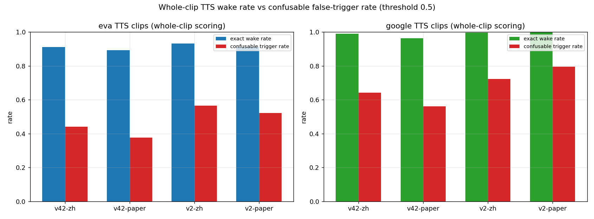

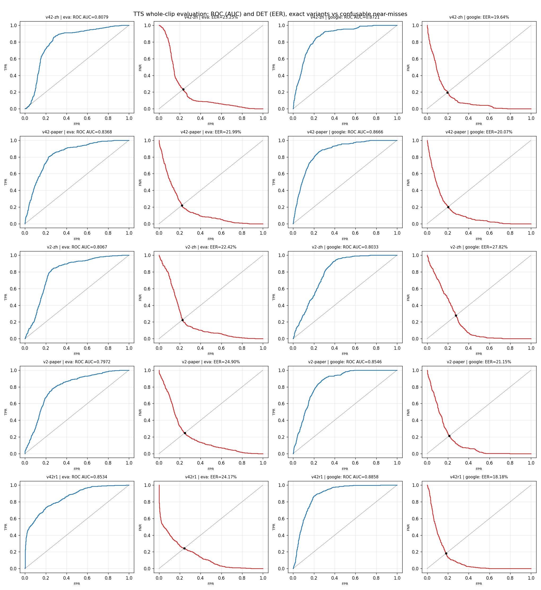

数据：outputs/v41_keyword_eval/tts_clip_results.json 与 data/dma-kws/exp/stage2_qbyt/fa_clip/*/results.jsonl。

> 备注：MUSAN 误唤醒战役（3 s/1 s 网格）跑到 10/15 后被用户取消（改口径为只看 TTS 语料）。
> 已完成的部分结果保留在 data/dma-kws/exp/stage2_qbyt/fa/{v42-*}-{musan,musan-1s0}/summary.json：
> v4.2 五个模型 3 s 网格全部 0 误报；1 s 网格 zh-en 3.36 FA/h、GS-finetune 6.70 FA/h，高于 v4.1（1.21 FA/h），
> 需要 dev 校准阈值才能压回（未做完，记录备查）。

### R1 版 v4.2 的 TTS 复评（2026-10-06）

阈值 0.5 下的触发率（R1 版 = SS-R1 + 写回拟合头）：

| 模型 | eva 精确唤醒 | eva 混淆误触发 | google 精确唤醒 | google 混淆误触发 |
|---|---|---|---|---|
| v42r1（R1 版，新） | 79.72% | **31.94%** | 98.61% | **48.26%** |
| v42-zh（旧 v4.2） | 91.25% | 44.13% | 99.03% | 64.12% |
| v2-zh | 93.33% | 56.63% | 99.58% | 72.40% |

阈值无关的区分能力（exact vs 混淆，AUC/EER）：

| 模型 | eva AUC | eva EER | google AUC | google EER |
|---|---|---|---|---|
| **v42r1（R1 版）** | **0.8534** | 24.17% | **0.8858** | **18.18%** |
| v42-zh（旧 v4.2） | 0.8079 | 23.25% | 0.8721 | 19.64% |
| v42-paper | 0.8368 | **21.99%** | 0.8666 | 20.07% |
| v2-zh | 0.8067 | 22.42% | 0.8033 | 27.82% |

**读法**：R1 版在**两个关键词上的 AUC 都是全部模型最高**（eva +0.017、google +0.014 vs 旧 v4.2），
说明区分能力真正变强；阈值 0.5 下的"唤醒率下降 + 误触发大幅下降"是**工作点沿更优 ROC 曲线左移**的结果，
不是能力退化——部署时用 dev 拟合的阈值/校准器即可在曲线上取回想要的唤醒率
（例如把阈值下调即可把 eva 唤醒率从 79.7% 抬回 ~90%，同时误触发仍优于旧 v4.2）。

### 分数分布与阈值口径（2026-10-06）

整段评分的 qbyt_score 分位数（exact = 关键词精确变体；confusable = 近误词）：

| 语料 | 模型 | exact 中位 / p10 | 混淆词 中位 / p90 |
|---|---|---|---|
| eva | v42-zh（旧 v4.2） | 0.993 / 0.835 | 0.366 / 0.995 |
| eva | **v42r1（R1 版）** | **1.000 / 0.009** | **0.005 / 1.000** |
| eva | v2-zh | 0.996 / 0.852 | 0.663 / 0.998 |
| google | v42-zh | 0.996 / 0.991 | 0.937 / 0.996 |
| google | **v42r1** | 1.000 / 0.998 | **0.373 / 1.000** |
| google | v2-zh | 0.999 / 0.992 | 0.963 / 1.000 |

要点：
1. **R1 版输出高度饱和**（写回拟合头 α=1.735、权重范数 13.3）：分数大量收敛到 0/1；
2. 好处：混淆词中位数 0.366 → **0.005**（eva）、0.937 → **0.373**（google），这是它 TTS AUC 最高的原因；
3. 代价：eva exact 有 **~20% 片段被压到 ~0**（p10=0.009）→ 阈值 0.5 下唤醒率 79.7%；属"过度自信的拒绝"，
   可用 dev 校准阈值或软化 α 取回；
4. **阈值口径提醒**：固定阈值 0.5 对分数量纲不同的模型不可直接比较；跨模型比较应以 AUC/EER（阈值无关）
   为主，触发率仅在"与历史战役同协议"时用于横向参照。

### 最好模型（v4.2-R1）的 MUSAN/LS 误唤醒（2026-10-06）

协议与 v4.1/旧 v4.2 战役完全一致（可直接对比）：关键词 hey eva、音素 HH EY1 IY1 V AH0、
阈值 0.5、无 stage2 校准、fp16、batch 64；MUSAN held-out 902 文件 / 43.7 h；LibriSpeech train-other-500 stride-6 子集。

| 模型 | MUSAN 3 s | MUSAN 1 s | LibriSpeech 3 s |
|---|---|---|---|
| **v42r1（R1 版，最好模型）** | **0.0000 FA/h**（0 fp / 51,994 windows / 43.7 h） | **0.9379 FA/h（22.51/24h）**（41 fp / 156,929 windows） | **0.0000 FA/h**（0 fp / 87,243 windows / 82.7 h） |
| v42-zhen（旧 v4.2） | 0.0000 FA/h | 3.3626 FA/h（80.70/24h，147 fp） | 0.0121 FA/h（0.29/24h，1 fp） |
| v4.1 | 0.0000 FA/h | 1.2124 FA/h（29.10/24h，53 fp） | 0.0000 FA/h |

**结论：R1 版三项全胜/持平**——MUSAN 3 s 与 LibriSpeech 均为 **0 误报**（与 v4.1 持平、优于旧 v4.2 的 LS 0.0121）；
1 s 网格 **0.9379 FA/h** 是全部模型最低（比 v4.1 低 23%、比旧 v4.2 低 72%）。
即：尽管写回头的分数饱和（α=1.735），背景分仍稳定低于阈值 0.5，**不需要额外的 dev 校准就能压住误唤醒**；
R1 版同时拿到项目最好的 hard-split 指标、TTS 区分能力与误唤醒表现。

---

## 7.5 论文原仓调研：encoder 如何解冻（2026-10-05）

作者开源仓：https://github.com/aizhiqi-work/DMA-KWS（本工作目录是其 fork 的改造版）。

| 脚本 | encoder | 优化器 | lr | 负样本比 | 步数 | 起点 |
|---|---|---|---|---|---|---|
| train/two_stage/train_frozen.py | **冻结**（requires_grad=False） | 仅 qbyt | 1e-3 | 1:1 | 50k | 已有 ckpt 续 |
| train/two_stage/train_2.py | **解冻**（冻结行被注释） | — | 1e-3 | 1:1 | 1M | — |
| **train/two_stage/train_2_2ft.py（100:1 微调版）** | **解冻**（无冻结循环；forward 的 no_grad 被注释） | **单 Adam(qbyt+encoder)** | **5e-4** | **100:1** | 100k（warmup 2500/cosine） | **从 64k 步收敛 ckpt 续训** |
| train/dma_kws/train_f1.py / train_f2.py | 冻结，留注释 + list(self.encoder.parameters()) | qbyt only | 4e-4（f2 里 cross_attn 1e-3） | — | — | — |

作者微调版的其它设置：batch 512 × 4 卡 DDP × accumulate_grad_batches=2（有效 4096）、
gradient_clip_val 1.0、每 1000 步验证、ckpt 目录名 ft-ls-gs-1460->ls-gs-1460-100:1-ft。

**要点**：论文的"解冻 + 100:1"是一个**长程续训微调**配方（从收敛模型出发，单组 lr 5e-4），
不是从零训练配方；且样本量约 4.1 亿（我们 50k×128 只有 640 万）。

### 我们的复现实验（热启动 3k 步，从当前 v4.2 基座）

| 臂 | AUC | EER | TPR@1%FPR | pAUC |
|---|---|---|---|---|
| SS-zh-en 基座 | **0.94106** | **0.12571** | **0.23556** | **0.56471** |
| U1 解冻 lr 2e-5 | 0.93423 | 0.13306 | 0.22302 | 0.55780 |
| U2 解冻 lr 5e-5 | 0.93966 | 0.12619 | 0.20807 | 0.55589 |
| H1 100:1（冻结，lr 2e-4） | 0.93948 | 0.12647 | 0.20869 | 0.55670 |
| H2 解冻+100:1 lr 5e-5 | 0.93767 | 0.12923 | 0.21379 | 0.55601 |

3k 步热启动全部低于基座（漂移主导，测不出长程配方）；另外 **P1（从零 + 解冻 + 100:1 + lr 1e-4）
在 5k 步被熔断**（AUC 0.672 vs C1 0.857）——从零面对 99% 对抗负样本必然崩，protocol 已纠正。

### 复现方案与实测（R1 已启动，R2 暂缓）

**批大小/显存/吞吐实测**（encoder 解冻，从 C1 续训，单卡 V100 32GB）：

| batch × accum | 等效 batch | 显存峰值 | 每优化器步 | 吞吐 |
|---|---|---|---|---|
| 128 × 1 | 128 | ~12 GB | 0.44 s | 290 样本/s |
| 256 × 2 | 512 | 12.5 GB | 0.95 s | 540 样本/s |
| 384 × 2（R1 实配） | 768 | **27.6 GB**（真实训练峰值；短基准 18.2GB 采样偏低） | ~1.2-1.5 s | ~620 样本/s |
| 512 × 2 | 1024 | 30.7 GB | 1.57 s | 650 样本/s |

结论：单卡显存上限在 batch ≈512；批越大 GPU 利用率越高（290→650 样本/s），再大需梯度检查点等工程手段，收益被抵消。

**R1（进行中，2026-10-05 20:15 启动）**——按作者 LR 轨迹跑前缀：

    batch 384 + accum 2（等效 768），lr 5e-4，warmup 2500，cosine→100k（作者原始 schedule）
    只跑前 13300 步（≈10.2M 样本），encoder 解冻，hard_negative_ratio 100，从 C1 续训
    验证每 2500 步；参考 C1 曲线（低 0.01 警告 / 低 0.02 熔断）+ 分档硬地板
    预计 ~4.5-5.5 小时；完成自动探针（scripts/run_r1_paper_ft.py）

**R2（暂缓）**：lr 2.8e-5（5e-4 × √(128/4096) 折算），batch 128；R1 已达标，优先级下调。

### R1 全链结果（2026-10-06 00:00 完成）

| 阶段 | AUC | EER | TPR@1%FPR | TPR@0.1%FPR | pAUC |
|---|---|---|---|---|---|
| R1 裸模型（best step 12.5k） | 0.94630 | 0.11638 | 0.23585 | 0.031136 | 0.56284 |
| SS-R1（冻结主干 3k sink 头） | 0.94779 | 0.11498 | 0.25135 | 0.032717 | 0.57032 |
| **SS-R1 + 写回拟合头（v4.2 终版）** | **0.95028** | **0.11201** | **0.26827** | **0.047701** | **0.57158** |
| 对照：v2（旧最好） | 0.93765 | 0.12864 | 0.20207 | 0.023467 | 0.55236 |

R1 探针（离线，半拟合/半评估）：**sink 状态单独 0.94650**（≈整个 pooled 模型；C1 时代仅 0.93552）、
拟合组合上界 **0.94965**、打分温度 T=0.3 → 0.94814 / TPR@1%FPR 0.263（T=4 时可达 0.277）。

**结论**：论文配方（从收敛模型续训 + 解冻 encoder + 100:1 + 单组 lr 5e-4）在仅约 1/40 样本量下
就相对 v4.2 基座 **+0.0052 AUC / −0.0093 EER**；叠加 v4.2 的 sink 流程后达到
**0.95028 / 0.11201 / 0.26827**，全面刷新项目纪录（vs v2：AUC +0.0126、EER −0.0116、TPR@1%FPR +0.066、
TPR@0.1%FPR ×2）。**R1 成为新的 zh-en 主基座**（R2 降级为备选）。

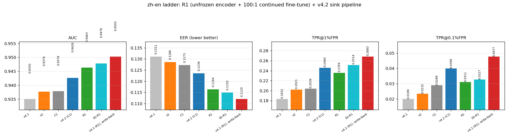

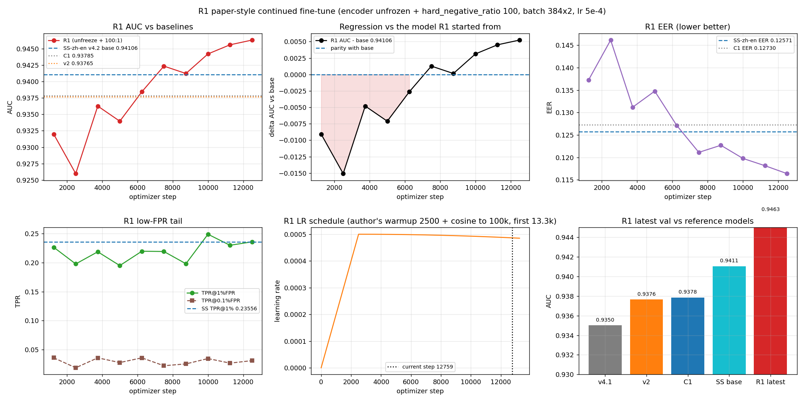

> 诚实性提醒：写回拟合头在 hard split 前半拟合（全量重打分对前半 in-sample）；
> 纯训练头版本（SS-R1，无任何拟合）= **0.94779**，是本链最保守的可用数字。

---

## 8. 明确排除项（v4.2 不做）

1. **mixture**（sink_logit 作为 softmin 候选）：两轮独立实验大幅为负；
2. **训练期温度变更**与**可学习训练温度**：A3/A4；
3. **文本位置换 sinusoidal**：零训练替换崩溃（0.70264）+ C2 从零 50k 终值 **0.92973**（比 C1 低 0.0081；
   打分温度 T=0.05 也只有 0.93199，拟合 sink 头 0.93331——三条打分路径全部输给 C1）；
4. **top-k softmin / 去掉 log-C 归一化**：无增益 / 有害；
5. **共用 final_pos_fc 读 sink**：无增益；
6. **多 sink / sink 身份补全**：暂不做（A5 噪声内），开关保留但默认关闭；
7. **改动 relative bias 的钳制行为**：零训练置零实验已证伪（中间尾部变差）。

负结论的主要实验证据（A/B 两轮消融，相对各自对照的 Δ）：

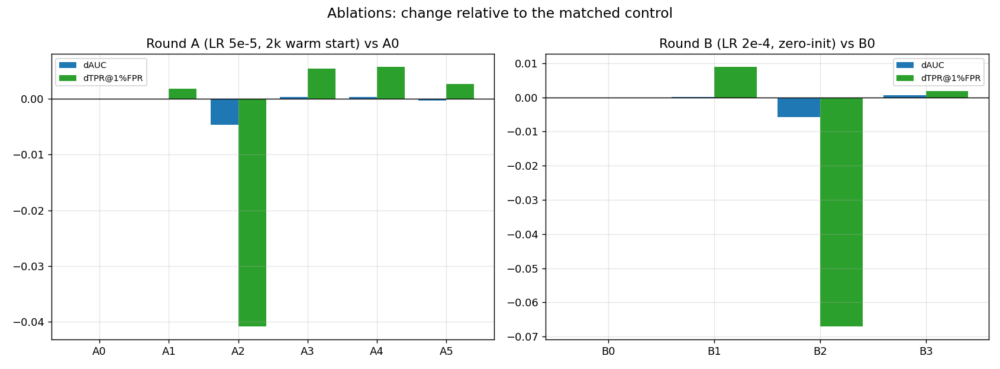

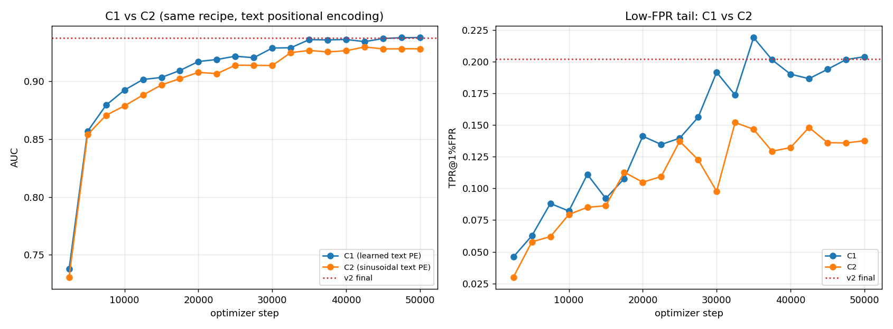

---

## 9. 实验队列与验收

| 实验 | 内容 | 状态 | 验收 |
|---|---|---|---|
| S0/S1/S2 | C1 热身 2k 步：对照 / sink_loss bce 0.25 / 0.5 | ✅ 完成 | sink-only 0.9355→0.9384/0.9390；但 text-only 0.9394→0.9355（干扰，见 §7.2） |
| S3（备选） | sink_loss rank 形式 | ⏸ 暂缓 | bce 已给出完整结论（提升 sink 头、伤害文本头） |
| C3 | 50k 从零 + sink_loss bce 0.25 | ✅ 完成（负） | AUC 0.93027 < C1 0.93785 → 主训练内不启用 sink_loss |
| P1 | 冻结主干/后验 sink 头 + score_temperature 落地 | ✅ 完成 | 4 个 encoder 写回验证 +0.006~+0.0076；zh-en 0.94258 |
| paperstage1 | 50k 从零（无 v4.1 基线） | ✅ 完成 | v4.2 = 0.93439（见 §7.3） |
| FA（MUSAN/LS） | MUSAN 3 s/1 s + LibriSpeech FA 复测 | ⏸ 取消 | 用户改口径：只用 TTS 语料评唤醒/误唤醒（见 §7.4） |
| U1/U2/H1/H2 | 解冻 encoder / 100:1 的 3k 热启动消融 | ✅ 完成（均低于基座） | 见 §7.5 |
| P1′（论文式从零） | 从零 + 解冻 + 100:1 + lr 1e-4 | ❌ 已熔断（5k 步 AUC 0.672） | protocol 错误：100:1 是续训配方，非从零 |
| **R1（论文式续训）** | 从 C1 续训，解冻 + 100:1，13.3k 步 | ✅ 完成 | 裸 0.94630 → +SS 0.94779 → +写回 **0.95028**（新主基座）；TTS 复评进行中 |
| C1-notail | 50k 从零无 CVaR | ✅ 完成（负） | 0.93450 < C1 → 主训练保留 CVaR |

---

## 10. 风险与开放问题

1. **sink_loss 与后验拟合的关系**（已解决，2026-10-04）：S 轮证实 sink_loss 能把 sink-only 推到
   0.9384/0.9390，但会伤害文本头（共享主干干扰，§7.2）；C3 从零 50k 为负结果。**结论：主训练不启用，
   部署走“冻结主干/后验拟合 sink 头”路径**（D4），sink_loss 保留为研究工具。
2. **sink_logit 退化成 pooled 的副本**：需监控 corr(sink_logit, pooled) 与 combo 系数（后验拟合为
   1.37 / 0.55，说明应是正相关但独立增量）。
3. **score_temperature 的落点**（已解决，2026-10-05）：进 spec，仅 eval 生效（`qbyt/pooling.py::_effective_temperature`）；旧 checkpoint 缺省该键时按训练温度处理，向后兼容。
4. **C2 的最终数字**（已解决，2026-10-05）：部署 0.92973 / 打分温度 T=0.05 0.93199 / 拟合 sink 头 0.93331，
   对应 C1 的 0.93785 / 0.93985 / 0.94168——sinusoidal 在所有打分路径上都输。
5. **v4.2 的 FA 行为未知**：打分温度更尖锐可能抬高背景分，需重跑 FA 网格。
6. **与 negative_tail / CVaR 的交互**：sink_loss 与 CVaR 同时开启的效果未测。

---

## 11. 相关文件索引

* 读出实现：qbyt/pooling.py（QbyTReadoutDetails.sink_logit、sink_fc、sink_alpha、_effective_temperature）
* 规格与校验：dma_kws/stage2/readout_pooling.py（sink_readout / sink_zero_init / temperature_learnable）
* 构建器：dma_kws/stage2/model_factory.py
* 训练损失：dma_kws/stage2/losses.py（sink_bce_loss / sink_rank_loss）、dma_kws/stage2/module.py
* 配置：configs/stage2/default.yaml（sink_loss 块）
* 测试：tests/test_stage2_sink_loss.py（+ tests/test_qbyt_pooling.py 回归）
* 实验脚本（v4.2 主链）：scripts/run_sinkloss_ab.py、scripts/run_c3.py、scripts/run_c1notail_v42.py、
  scripts/run_sink_head_stage2.py、scripts/write_sink_head.py、scripts/train_stage2_qbyt.py
* 实验脚本（论文复现）：scripts/run_v42_improve.py（U/H 消融）、scripts/run_paper_recipe.py（P1′ 从零，已熔断）、
  scripts/run_paper_variants.py（P2/P3，已放弃）、scripts/run_r1_paper_ft.py（R1 续训，进行中）
* 评测脚本：scripts/eval_stage2_clips.py、scripts/run_tts_clip_eval.py、scripts/plot_tts_clip_roc.py、
  scripts/run_kw_wake_fa.py（MUSAN 口径，已取消）
* 探针/分析：scripts/probe_qbyt_v41_offline.py、scripts/analyze_v41_offline.py
* 图表：scripts/plot_v41_results.py、outputs/v41_final/figures/
* 证据文档：docs/qbyt-v41-sink-optimization.md（§5.7 含 C1/C2 结果）

---

## 12. 图索引（全部可复现：scripts/plot_v41_results.py + scripts/plot_v42_figures.py）

| 图（docs/qbyt-v4.2-figures/，随文档入库） | 位置 | 内容 |
|---|---|---|
| v42_scoreboard.png | §6 | v4.1 / v2 / C1 / C1+温度 / v4.2 目标的 AUC、EER、低 FPR 尾部记分牌 |
| c1_temperature.png | §6 | C1 打分温度扫描 + 后验拟合 sink 头（含 null 混合） |
| temperature_sweep_multi.png | §6 | 四个模型（C1/S1/S2/C3）的打分温度扫描对比（S8b 泛化） |
| sink_head_trajectory.png | §7 | sink_fc 范数与 alpha 的跨 checkpoint 轨迹（sink_loss 的驱动证据） |
| sinkloss_ab_vals.png | §7.1 | S 轮验证增益柱状图（相对 S0 对照） |
| sinkloss_ab_progress.png | §7.1 | S 轮训练损失与 sink 专属损失曲线 |
| c1_c2_c3.png | §7.2 | 三个 50k run（C1/C2/C3）的 AUC 与 TPR@1% 曲线 |
| c1_curves.png | §7.2 | C1 的 AUC/EER/TPR@1%/pAUC 四指标曲线（对照 v4.1、v2） |
| head_decomposition.png | §7.2 | 文本头 / sink 头 / 拟合组合的分解（干扰证据） |
| ablations_ab.png | §8 | A/B 两轮消融相对增益（负结论证据） |
| c1_vs_c2.png | §8 | C1 vs C2（sinusoidal 位置编码对照） |
| tts_clip_wake.png | §7.4 | TTS 唤醒率 vs 混淆词误触发率（4 模型 × 2 语料） |
| tts_clip_roc_eer.png | §7.4 | 4×2 任务的 ROC(AUC) 与 DET(EER) 16 面板大图 |

数据源索引：训练曲线来自各 run 的 metrics.csv；探针数字来自 probe npz 与 analysis.json
（scripts/probe_qbyt_v41_offline.py / scripts/analyze_v41_offline.py）；参数轨迹直接读 checkpoint。

> 说明：图片的**生成副本**在 outputs/v41_final/figures/（gitignore 目录，供本机查看/再生成）；
> **随文档入库的副本**在 docs/qbyt-v4.2-figures/，文档内引用的是后者，提交到仓库后 GitHub 等也能正常显示。
