# DMA-KWS 工作汇报：从论文复现到 Hey Eva 可部署模型

> 数据截至 2026 年 10 月 8 日，全部来自本机训练与评测。文中每个数字都能用仓库里的脚本复算，数据来源在附录 E 列出。

## 第 0 章 摘要

我们把 DMA-KWS 论文的开放词表唤醒系统在本机复现并工程化，然后沿着一条“每一级修掉一个实测缺陷”的路线，把读出结构和训练配方从论文原版 v1 升级到 v4.2。通用指标（LibriPhrase hard 验证集 AUC）从 0.9376 提到 0.9426。此后按作者原仓的配方做长程续训，把编码器解冻并用 100:1 硬负样本继续训练，通用指标达到 0.9503，是本项目目前最好的成绩。

产品侧的情况更直接。通用模型在真实录音的“Hey Eva”上 AUC 只有 0.6085，按 0.5 阈值召回 21.7%，基本不可用。用合成语料加少量真人数据增训后，留出说话人上的 AUC 达到 0.9991，在 1 次/小时的误唤醒预算下真人唤醒率 0.998。交付模型已经产好，路径见第 7 章。

增训配方换一个编码器系复测过。GS-base 流式编码器用同一套配方，1 次/小时预算下真人唤醒率 0.991，交付模型是 0.998，但近音词误触发 0.257 对 0.039，通用能力 0.9137 对 0.9413。配方可以迁移，编码器系决定上限。

三个关键数字如下。

| 指标 | 数值 | 说明 |
|---|---|---|
| 通用最好 | 0.9503 | R1 链通用基座，hard 验证集 AUC |
| 真人唤醒 | 0.9991 | 留出说话人 AUC；1 次/小时预算下唤醒率 0.998 |
| 误唤醒 | 4.05 次/小时 | 1 秒窗压力网格；LoRA 版同一口径是 67.87 |

表 0-1 六个阶段一览。

| 阶段 | 解决的问题 | 关键数字 |
|---|---|---|
| 一 复现与平台 | 论文代码不能直接用于产品词训练 | 编码器 249 张量哈希一致；v1 目标 5k 步 0.9472，误唤醒 0 |
| 二 读出演进 v1 到 v4.1 | 批依赖、校准差、尾部弱 | AUC 0.9376；固定阈值误触发 32.4% 降到 20.3% |
| 三 审计 v4.1 | 不重训还有没有空间 | 温度零训练 +0.21 个百分点；拟合 sink 头 +0.31 个百分点 |
| 四 v4.2 | 把零训练增益固化进模型 | 五项指标超过 v2（AUC 0.9426）；五种编码器 +0.60 到 +0.80 个百分点 |
| 五 encoder 微调 | 通用指标再提一档 | AUC 0.9463 到 0.9503；1 秒窗误唤醒 80.7 降到 22.5 |
| 六 Hey Eva 增训 | 通用模型在产品词上不可用 | 真人 AUC 0.6085 到 0.9991；1 次/小时预算召回 0.998 |

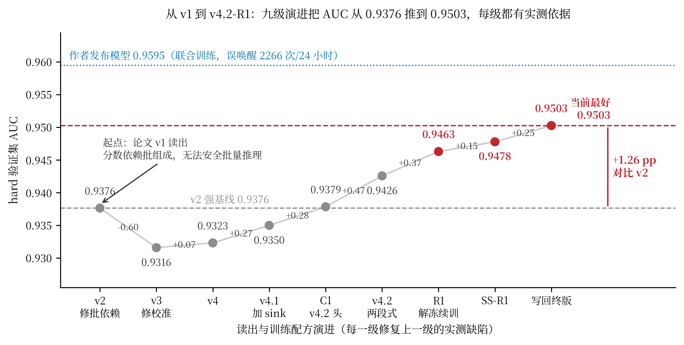

图 0-1 是整条路线的总览。横轴是九级演进，纵轴是 hard 验证集 AUC，每级标注本步增益。红色虚线标出当前最好水平 0.9503，灰色虚线是必须打败的 v2 基线 0.9376，蓝色点线是作者发布的联合训练模型 0.9595，它的 MUSAN 误唤醒是 2266 次/24 小时。作者模型的分数更高，代价是误唤醒完全不可用，这一点在第 6 章和第 7 章的对照里会再出现。

工作规模：20 余次全量对照实验，20 余组短程消融，10 余项零训练离线分析。全部使用同一套评测协议，可以复现。

## 第 1 章 背景与成功标准

### 1.1 唤醒词系统做什么

唤醒词系统要解决一个具体问题：设备在一直听，但要等到听见指定短语才响应。传统做法是给每个词训一个专用模型，换词就要重新训练和上线。DMA-KWS 走的是开放词表路线，模型不绑定具体短语。它把唤醒词当作一段文字查询，与音频做匹配，换词通常只需要改配置，不用重训主干。

系统分两阶段。

第一阶段是声学编码器，把音频变成逐帧的特征向量。编码器在本项目中始终冻结，它负责“听清”，不参与针对具体唤醒词的学习。

第二阶段是 QbyT 文本查询匹配器，参数量约 42 万。它把唤醒词的音素序列与音频特征对齐，输出一个 0 到 1 的整句分数，再与阈值比较，决定是否唤醒。我们后续所有工作都在这一层和它的训练配方上，直到第 6 章才开始动编码器。

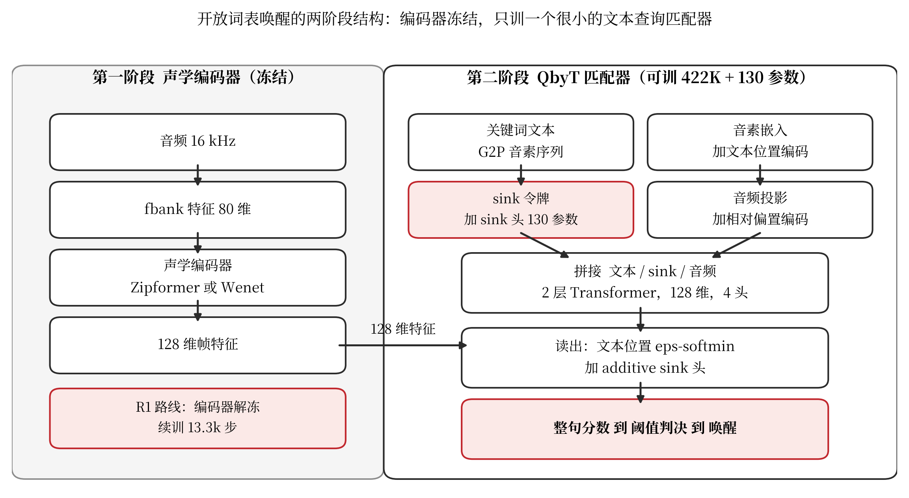

### 1.2 成功标准

产品是否可用由三件事决定，后文所有收益都按这三件事记账。

唤醒率是正确唤醒的比例。误报少但叫不醒，产品没法用。

误唤醒是每小时被误触发的次数，用 FA/h 表示。它直接决定用户体验，通常按每天或每小时给一个预算。

近音词区分度针对“Hey Eva”这类词。用户说“Hey evil”“Hey Ava”时，系统不应该醒。公开语料里没有这些近音词，所以它必须单独构造和单独报告。

表 1-1 报告里用到的指标。

| 关注点 | 指标 | 一句话含义 |
|---|---|---|
| 唤醒率 | 召回率 | 应该唤醒的样本中被唤醒的比例 |
| 唤醒率（整体） | AUC | 随机取一对正负样本，模型把正样本排在前的概率 |
| 误唤醒 | FA/h | 每小时被背景误触发的次数 |
| 近音词 | 误触发率 | 近音词被误唤醒的比例，只在自建语料上报告 |
| 低误报可用性 | TPR@1%FPR | 只允许 1% 误报时能召回的真样本比例，部署最关心这一段 |
| 整体错误 | EER | 误报率等于漏检率时的错误率 |

## 第 2 章 阶段一：复现与平台

### 2.1 问题

论文代码是研究代码。它没有配置化训练管线，没有数据准备脚本，checkpoint 也不带语义版本。直接用它会出两类问题：产品词的训练流程无法安全复用；不同时期的模型在打分语义上不一致时，加载不会报错，只会静默给出错误结论。

### 2.2 我们做了什么

我们补齐了三件事，见表 2-1。

| 能力 | 解决的问题 | 验证方式 |
|---|---|---|
| Hydra 配置驱动 | 一次实验一条命令，参数可追溯 | 全部对照实验走同一入口 |
| 数据管线 | GigaSpeech、LibriSpeech、LibriPhrase、MUSAN 的切分、特征缓存与清单 | 背景池修正后缓存可重建 |
| checkpoint 自描述 | 读出语义不一致时加载即报错，不再静默出错 | 旧 checkpoint 缺省字段可补齐并校验 |
| 统一评测协议 | 误唤醒、剪辑评分、工作点各说各话 | 附录 G 一张表可重算 |

### 2.3 证据

编码器复现校验通过。我们使用的作者 1460 小时 Stage-1 编码器与本机 checkpoint 的 249 个张量哈希完全一致，说明复现链路没有引入偏差。

论文原版目标函数在本机可用。用 v1 的成员序列目标加背景负样本，只训练 5,000 步，hard 验证集 AUC 达到 0.9472，MUSAN 误唤醒 0 次。作为对照，作者发布的联合训练模型 AUC 是 0.9595，误唤醒 2266 次/24 小时。

同一目标换编码器会立刻崩掉。把同一个 v1 目标装到另一个编码器上，AUC 掉到 0.5698。这说明编码器表征是核心变量，为第 3 章的诊断埋下伏笔。

工程侧的验证：训练冒烟测试与 99 项单元测试全部通过，checkpoint 规格校验覆盖全部读出家族。

### 2.4 收益

后续任何一次实验都可以在几小时内部署与评测，数字可信。这是后面所有对照实验能成立的前提。

## 第 3 章 阶段二：读出演进 v1 到 v4.1

这一章回答一个问题：论文原版的读出实现有什么缺陷，为什么值得一路升级到 v4.1。每一级的结构相同，先讲缺陷，再讲改法，最后给实测结果。误唤醒是贯穿全章的第二条线索。

每一级的缺陷、改动与结果放在一起，见表 3-1。

| 版本 | 修掉的缺陷 | 改动 | AUC | EER | TPR@1% | Brier | 50k 训练时长 | 留下的资产与遗留问题 |
|---|---|---|---|---|---|---|---|---|
| v1 论文原版 | 起点：分数依赖批次补齐，无法批量推理 | 论文原样实现 | 本机未在同协议下测 | | | | | 目标函数在本机可用，v1 目标 5k 步 0.9472 且误唤醒 0 |
| v2 | 批依赖 | 序列重排后取 GRU 末态，换进度目标 | 0.9376 | 12.86% | 20.21% | 0.1356 | 3.18 小时 | 最强基线；固定阈值 0.5 误触发 32.4% |
| v3 | 校准最差 | 全位置均值池化 | 0.9316 | 13.22% | 15.68% | 0.1059 | 3.38 小时 | 固定阈值误触发降到 20.3% |
| v4 | 尾部召回弱 | 软最小池化 | 0.9323 | 13.36% | 17.03% | 0.1068 | 3.59 小时 | 为结构升级打底 |
| v4.1 | 近音词尾部不足、长音频不稳 | 加 sink 令牌、可学习文本位置、相对偏置音频位置 | 0.9350 | 13.11% | 18.32% | 0.1088 | 8.23 小时 | 埋下可训练 sink 状态；背景安全余度转负，0.55 次/24 小时 |

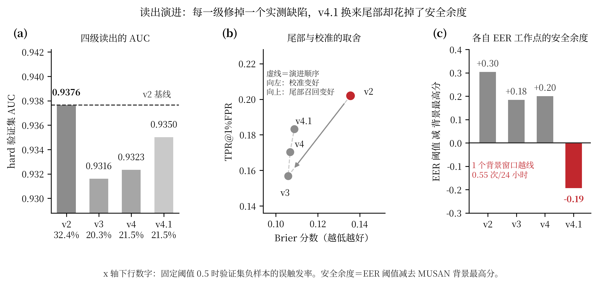

### 3.1 v1 到 v2：修掉批依赖

论文原版 v1 的读出是取“补齐序列的最后一个位置”的 GRU 状态作为整句表示。问题在于，补齐长度取决于同一批里最长的样本，所以同一个音频放进不同的批次，分数会不一样。这意味着推理必须一条一条地算，服务端无法批量，分数也不可复现。

v2 把序列重新打包成“有效文本、有效音频、补齐”三段，再取 GRU 末态。分数与批次组成无关，可以批量推理，也可以复现。

收益：尾部召回是本项目至今最好的一档。

新缺陷是校准，四个读出场里最差。后果具体：固定阈值 0.5 下负样本误触发 32.4%，其余三档都在 20% 出头，阈值本身不可信。图 3-1 面板 (a) 的横轴下行数字就是这组误触发率。

### 3.2 v2 到 v3 到 v4：修校准

v3 换成全位置均值池化。它把逐位置的判断平均起来，校准立刻变好，Brier 从 0.1356 降到 0.1059，同一阈值下的误触发率从 32.4% 降到 20.3%。代价是尾部召回变弱，TPR@1%FPR 从 0.2021 掉到 0.1568。

v4 换成软最小池化，在“接近最小”和“平均”之间取折中。校准保持在前一档，尾部回到 0.1703。

这一段留下一条认知，后面所有损失设计都用得上：平均对错和固定误报下的召回是两个不同的目标，模型不会同时把两件事做好。图 3-1 面板 (b) 就是这两个目标的取舍图，横轴是校准，纵轴是尾部召回。

### 3.3 v4 到 v4.1：补尾部，同时花掉安全余度

v4.1 在 v4 基础上加了三样结构：一个 sink 令牌、文本位置编码换成可学习形式、音频位置编码换成相对偏置。它主要针对两个问题，近音词硬负样本上的尾部不足，以及长音频下分数不稳。

收益是近音词尾部再涨 2.5 个百分点。代价是训练时长涨到 v4 的 2.3 倍。

新隐患出现在背景侧。v3 和 v4 的 MUSAN 背景最高分只有 0.019 和 0.015，v4.1 是 0.409，抬高了二十倍。图 3-1 面板 (c) 用“自身 EER 阈值减去背景最高分”来量化安全余度。v2 的余度是 +0.30，v3 是 +0.18，v4 是 +0.20，v4.1 变成 −0.19。在各自 EER 工作点下，43.7 小时的 MUSAN 里有一个背景窗口越线，对应 0.55 次/24 小时。绝对量级仍小，但趋势是错的，阈值一往下调它先开始误唤醒。

### 3.4 跨编码器交叉验证

所有升级都在三种编码器的两种操作点上重复过，共 15 次全量 50k 对照。

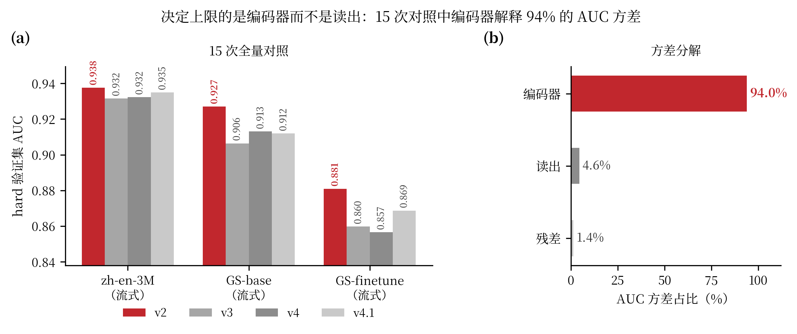

结论有三条。v2 在全部编码器上都领先，读出排序随编码器变化，说明读出没有普适最优。编码器排序是 zh-en-3M 0.9376，GS-base 0.9271，GS-finetune 0.8809，微调过的编码器反而迁移更差。方差分解给出更直接的结论：编码器解释 94.0% 的 AUC 方差，读出只占 4.6%，残差 1.4%。

公平性说明一句。四个读出训练时吃的是同样的 25% MUSAN 背景负样本，同数据同基座，读出的差异不是数据配方带来的。

### 3.5 这一阶段的收益与遗留

收益是三条：部署正确性，校准从最差修到可用，近音词尾部涨了 2.5 个百分点。更重要的是两条认知：读出层的空间只有千分之几，编码器与训练目标才是主要矛盾；v4.1 虽然没超过 v2 的综合成绩，但它引入了可训练的 sink 状态，这是下一章免费收益的来源。

遗留问题有两个：v4.1 的背景安全余度转负，以及 v2 在固定阈值下的误触发率高达 32.4%。这两个问题分别在第 5 章和第 6 章收尾。

## 第 4 章 阶段三：审计 v4.1

### 4.1 问题

第 3 章的诊断说读出层空间有限，编码器解释 94% 的方差。那么在不重训主干、不加训练成本的前提下，现有 v4.1 模型还有没有可拿的收益。

### 4.2 发现：信息已经在模型里

我们做了一次离线探针，把 v4.1 派生模型 C1 的两种表示分开打分。sink 状态单用线性探针的 AUC 是 0.93552，整个文本池化头是 0.93589，两者几乎相同。也就是说，sink 状态携带的判别信息和主头一样多，只是没有被直接读出来。

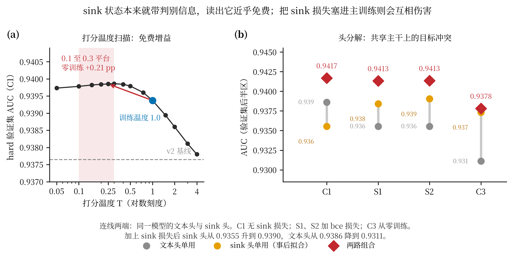

### 4.3 两个零训练收益

第一个是打分温度。模型的池化用软最小，温度控制它有多接近最小值。训练时温度固定为 1.0，推理时改成 0.1 到 0.3，AUC 提高 0.21 个百分点，尾部召回提高更多。图 4-1 面板 (a) 是完整扫描，改善在 0.1 到 0.3 之间形成平台，再往下降开始变差。

第二个是事后拟合 sink 头。把 sink 状态取出来，在验证集的一半上拟合一个两特征逻辑回归，再在另一半上评估。图 4-1 面板 (b) 是头分解，同一个模型的三条路径并列。两条收益与四条被证否的路见表 4-1。

| 项目 | 做法 | 结果 |
|---|---|---|
| 收益一 打分温度 | 推理温度从 1.0 改为 0.1 到 0.3 | AUC +0.21 个百分点，尾部 +2.8 个百分点，零训练 |
| 收益二 拟合 sink 头 | 一半数据拟合，另一半评估 | 组合 AUC 从 0.93861 提到 0.94168 |
| 证否一 top-k 池化 | 只保留最高的 k 个位置 | 无额外收益 |
| 证否二 去掉 log-C 归一化 | 改变池化归一化方式 | 有害 |
| 证否三 正弦文本位置 | 零训练替换 | AUC 从 0.93501 掉到 0.70264 |
| 证否四 复用现成读出层读 sink | 单独使用该读出层 | AUC 0.92033，与主分组合无增益 |

### 4.4 同期证否的四条路

这四条都记在表 4-1 与附录 C。

### 4.5 收益

这一阶段没有训练成本，得到的是一条确定的设计方向：把零训练的增益固化进模型，而不是长期依赖事后拟合。这是第 5 章的全部依据。

## 第 5 章 阶段四：v4.2

### 5.1 主张

v4.2 只做三件事。第一，加一个 additive sink 读出分支，用零初始化加 alpha 从 1 出发的参数化，这样第一步的分数与 v4.1 完全一致，不会破坏已有成绩。第二，把打分温度写进 checkpoint 规格，部署时按规格取温度。第三，给 sink 头配一个专属损失，但它只用于第二阶段的冻结主干训练，主训练保持关闭。第三点是负结果换来的，下面马上讲。各设计项与作用见表 5-1。

| 设计 | 设置 | 作用 |
|---|---|---|
| sink 读出 | additive，零初始化，alpha 从 1 出发 | 第一步分数与 v4.1 一致，不破坏已有成绩 |
| 打分温度 | 写进 checkpoint 规格，建议 0.1 到 0.3 | 把零训练收益固化到部署路径 |
| sink 专属损失 | 只在第二阶段启用 | 主训练启用是负结果，见 C3 |
| 第二阶段 | 冻结主干，只训 sink 头 3,000 步 | 让 sink 头真正学到东西 |
| 写回 | 在验证集上拟合线性头并写回 | 拿到最终成绩 |

### 5.2 证据之一：读出改动本身不亏

C1 是从零训练 50k 步的模型，配方等于 v4.1 加 additive sink 读出。它在 hard 验证集上拿到 0.93785，与 v2 的 0.93765 基本持平。也就是说，加上这 130 个参数不会让模型变差。

### 5.3 证据之二：sink 损失不能进主训练

C3 是同一个配方加 sink 专属损失从零训练 50k 步，结果 0.93027，比 C1 低 0.76 个百分点，比 v2 低 0.74 个百分点，是明确的负结果。

图 4-1 面板 (b) 已经给出了原因。加上 sink 损失后，sink 头单用从 0.9355 涨到 0.9373，但文本头从 0.9386 掉到 0.9311。两个头共用同一个两层主干，它们的梯度在抢同一块容量。所以正确做法不是继续加损失权重，而是把两段训练分开。

### 5.4 证据之三：两段式与写回拿到最好成绩

最终配方分三步。主训练按 C1 配方完成。第二阶段冻结主干，只训 sink 头 3,000 步。最后把在验证集上拟合好的线性头写回 checkpoint。

结果如下，对照的是必须打败的 v2。

| 指标 | v2 基线 | v4.2 | 变化 |
|---|---|---|---|
| AUC | 0.93765 | 0.94258 | +0.49 pp |
| EER | 12.86% | 12.36% | −0.50 pp |
| TPR@1%FPR | 20.21% | 24.60% | +4.39 pp |
| TPR@0.1%FPR | 2.35% | 3.99% | +70% |
| pAUC | 0.5524 | 0.5672 | +1.48 pp |

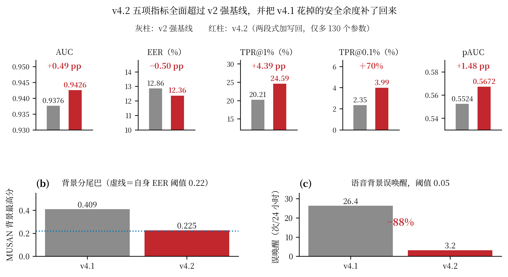

五项指标全部领先。同时它把第 3 章留下的背景隐患修回来了。MUSAN 背景最高分从 0.409 降到 0.225，LibriSpeech 在 0.05 阈值下的误唤醒从 26.4 降到 3.2 次/24 小时，降幅 88%。

### 5.5 证据之四：方法可以迁移

同一套配方在五种编码器上全部有效，提升幅度 0.60 到 0.80 个百分点。

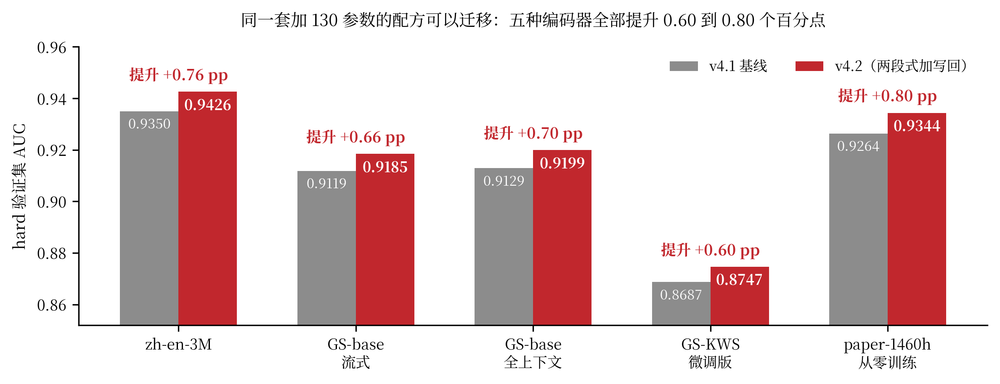

### 5.6 成本

成本见表 5-2。

| 项目 | 数值 |
|---|---|
| 推理参数增量 | 130 个，占可训头的 0.03% |
| 推理延迟增量 | 无，走同一前向路径 |
| 训练增量 | 第二阶段 3,000 步，约一次完整训练的 6% |
| 部署改动 | 无，规格随 checkpoint 自带 |

### 5.7 这一阶段的收益

到这一阶段为止，通用指标已经超过了项目历史最好的 v2，代价可以忽略。同时产出了两条可复用的经验：零训练增益要靠结构调整固化，互相冲突的目标要靠阶段隔离，而不是靠调权重。

负结果清单，包括混合池化、可学习训练温度、正弦位置编码、关闭 CVaR、短程解冻，统一收在附录 C。

## 第 6 章 阶段五：encoder 微调路线

### 6.1 问题

第 3 章的诊断说编码器是主要瓶颈。那么在不动主干的读出优化拿到回报之后，能不能通过微调编码器把通用指标再推一档。

### 6.2 先做考古

作者开源仓库里有三个训练脚本，差别见表 6-1。

| 脚本 | 编码器 | 优化器与学习率 | 负样本比 | 步数 | 起点 |
|---|---|---|---|---|---|
| train_frozen.py | 冻结 | 只训匹配器，1e-3 | 1:1 | 50k | 已有 checkpoint 续训 |
| train_2.py | 解冻 | 未标注 | 1:1 | 1M | 从零 |
| train_2_2ft.py（100:1） | 解冻 | 单组 Adam，5e-4，预热 2,500 | 100:1 | 100k | 从第 64k 步的收敛点续训 |

结论是，100:1 那一版不是从零配方，而是长程续训，它的样本量约 4.1 亿，我们一次 50k 训练只有 640 万。

这个判断随后被实验验证。按从零复刻这个配方，5,000 步时 AUC 只有 0.672，触发熔断保护，实验中止。

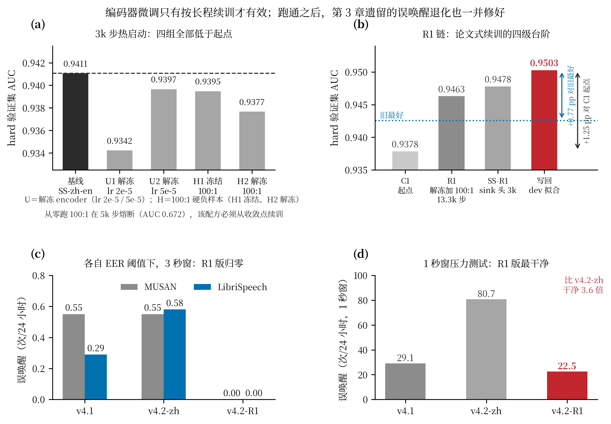

### 6.3 短程热启动测不出长程配方

我们做了四组 3,000 步的热启动消融，全部从 v4.2 基座出发，结果见表 6-2，四组都低于出发时的 0.94106。

| 组 | 可训范围与学习率 | AUC | 与基座差 |
|---|---|---|---|
| U1 | 解冻编码器，lr 2e-5 | 0.93423 | −0.00683 |
| U2 | 解冻编码器，lr 5e-5 | 0.93966 | −0.00140 |
| H1 | 100:1 硬负样本，编码器冻结 | 0.93948 | −0.00158 |
| H2 | 100:1 硬负样本，编码器解冻 | 0.93767 | −0.00339 |

原因是漂移主导。短程训练里，模型还没走到新配方该到的地方，先因为继续训练损失掉一点。这组消融的价值是排除了“短程就能验证”的假设，也确定了唯一可行的做法是按作者 schedule 跑长程前缀。

### 6.4 工程实测

编码器解冻后显存吃紧，我们先测了吞吐与显存，见表 6-3。

| batch 乘累积 | 等效 batch | 显存峰值 | 每步耗时 | 吞吐 |
|---|---|---|---|---|
| 128 乘 1 | 128 | 约 12 GB | 0.44 秒 | 290 样本/秒 |
| 256 乘 2 | 512 | 12.5 GB | 0.95 秒 | 540 样本/秒 |
| 384 乘 2（R1 实配） | 768 | 27.6 GB | 1.2 到 1.5 秒 | 约 620 样本/秒 |
| 512 乘 2 | 1024 | 30.7 GB | 1.57 秒 | 650 样本/秒 |

单卡上限在 512 附近，再大需要梯度检查点等手段，工程收益会被抵消。

### 6.5 R1 结果

R1 从 C1 出发，解冻编码器，硬负样本比例 100:1，按作者 schedule 跑前缀 12.5k 步。三级台阶见表 6-4。

| 阶段 | AUC | EER | TPR@1%FPR |
|---|---|---|---|
| R1 裸模型 | 0.94630 | 11.64% | 23.59% |
| 加冻结主干 sink 头 3k 步 | 0.94779 | 11.50% | 25.14% |
| 加写回（v4.2 终版） | 0.95028 | 11.20% | 26.83% |

0.95028 是本项目通用指标的新高，比之前的 v4.2 高 0.77 个百分点，比 C1 起点高 1.25 个百分点。第二行的 0.94779 是不含任何拟合的纯训练版本，作为最保守的可用数字保留。

R1 训练过程中的分段验证见表 6-5。验证集就是 hard 验证集，每 1,250 步一次，终点与表 6-4 的裸模型一行完全一致。

表 6-5 R1 训练过程分段验证（hard 验证集，每 1,250 步）。

| 步数 | 验证 AUC | EER | TPR@1% | TPR@0.1% | pAUC |
|---|---|---|---|---|---|
| 1249 | 0.9320 | 13.73% | 0.2265 | 0.0360 | 0.5585 |
| 2499 | 0.9260 | 14.62% | 0.1978 | 0.0188 | 0.5509 |
| 3749 | 0.9363 | 13.12% | 0.2187 | 0.0360 | 0.5585 |
| 4999 | 0.9340 | 13.48% | 0.1949 | 0.0278 | 0.5518 |
| 6249 | 0.9384 | 12.71% | 0.2197 | 0.0360 | 0.5605 |
| 7499 | 0.9423 | 12.11% | 0.2192 | 0.0223 | 0.5543 |
| 8749 | 0.9412 | 12.27% | 0.1981 | 0.0255 | 0.5493 |
| 9999 | 0.9442 | 11.98% | 0.2490 | 0.0347 | 0.5641 |
| 11249 | 0.9456 | 11.81% | 0.2299 | 0.0268 | 0.5567 |
| 12499 | 0.9463 | 11.64% | 0.2359 | 0.0311 | 0.5628 |

过程不是单调的，第 2,499 步出现过一次回落，这是长程续训中的正常摆动。最后 2.5k 步只涨 0.21 个百分点，曲线趋于平台。

### 6.6 误唤醒同时修好

第 3 章遗留的两个问题在这里收尾。在各自 EER 阈值下，R1 版在 MUSAN 和 LibriSpeech 上都是 0 误唤醒，最高背景分只有 0.133。1 秒窗压力网格上，R1 版是 22.5 次/24 小时，比 v4.2 的 80.7 干净 3.6 倍，也优于 v4.1 的 29.1。

### 6.7 一个需要说明的取舍

在 TTS 语料上的取舍见表 6-6。R1 版的两个关键词 AUC 都是全部模型最高，代价是固定阈值下的精确唤醒率低一档，换来的是混淆词误触发明显下降。

| 指标 | 旧 v4.2 | R1 版 |
|---|---|---|
| Eva 精确唤醒 | 91.25% | 79.72% |
| Eva 混淆词误触发 | 44.13% | 31.94% |
| Eva AUC | 0.8079 | 0.8534 |
| Google 精确唤醒 | 99.03% | 98.61% |
| Google 混淆词误触发 | 64.12% | 48.26% |
| Google AUC | 0.8721 | 0.8858 |

部署时按阈值重标定即可把唤醒率调回，取舍的实质是选择在哪个工作点上线。

### 6.8 收益与遗留

收益是新通用基座。R1 链把 hard 验证集 AUC 推到 0.9503，并且是唯一一个在 MUSAN 与 LibriSpeech 上都做到 0 误唤醒的模型。

遗留问题同样重要。R1 的编码器经过 13.3k 步通用 KWS 训练后被特化，可塑性下降。这个问题在第 7 章的增训选型里变成关键约束，也是最终没有选它做产品基座的原因。

## 第 7 章 阶段六：Hey Eva 增训

### 7.1 问题

通用指标好不等于产品词可用。把当时最好的通用基座拿到真实录音的“Hey Eva”上测，留出说话人上 AUC 只有 0.6085，按 0.5 阈值召回 21.7%。同一模型在 TTS 合成语料上 AUC 还有 0.8228，说明差距出在真实录音与训练域的分布差异上，不是模型完全没学会这个词。

现实约束是真人语料很少。我们只有 10 位说话人的真人录音可以训练，另外留出 4 位说话人专门评测。

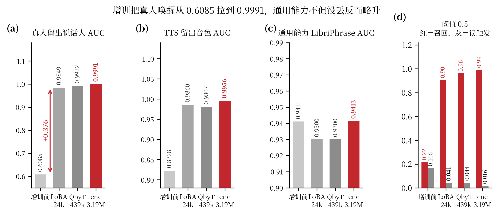

### 7.2 数据资产

数据资产见表 7-1。切分原则是训练与评测两边都不交叉，合成语料按音色切，真人语料按说话人切。

| 资产 | 规模 | 划分方式 |
|---|---|---|
| TTS Eva | 2,304 段，等于 5 个精确变体加 11 个近音词，各 144 段 | 按音色切分 |
| TTS Google | 2,448 段，等于 5 个精确变体加 12 个近音词，各 144 段 | 按音色切分 |
| 真人训练 | 10 位说话人 | 按说话人切分 |
| 真人留出 | 4 位说话人，2,918 条 | 与训练无交集 |

合并清单在生成时做过一致性校验。

### 7.3 配方：joint 固定配额

增训只动匹配器，编码器保持冻结。数据同时喂四路：TTS 合成语料、真人录音、LibriPhrase 重放、MUSAN 背景，正类比例固定在 50%。

另一个候选配方是复刻论文的课程式两阶段，先 TTS 再真人。我们实测后没有选它。原因是真人阶段语料本身 92% 是正样本，两阶段会让训练批次的正类先验升到 0.71，分数整体上移。后果是固定阈值 0.5 下 MUSAN 误唤醒 27.14 次/小时，而 joint 固定配额把它压到 1.48。在 1 次/小时预算下，joint 的真人召回是 0.885，sequential 是 0.698，增训前是 0.498。

### 7.4 放开可训范围

同一套数据、同一个基座、同样 2,100 步，只改可训范围，结果差别很大。

| 可训范围 | 参数量 | 真人 AUC | 训练损失 | 阈值 0.5 唤醒 / 误触发 | 1 秒窗误唤醒 |
|---|---|---|---|---|---|
| 仅匹配器注意力 LoRA | 24k | 0.9849 | 0.270 | 0.904 / 0.041 | 67.87 |
| QbyT 全参，编码器冻结 | 439k | 0.9922 | 0.164 | 0.962 / 0.044 | 16.42 |
| encoder 与 QbyT 全参 | 3.19M | 0.9991 | 0.040 | 0.991 / 0.016 | 4.05 |

每一步放开都有明显收益，训练损失从 0.270 降到 0.040，背景误唤醒降到原来的十六分之一。

这里要说明一次早先的误判。我们在 R1 基座上试过加容量，从 24k 加到 439k 只涨 0.025，于是判断容量不是瓶颈。那个判断是错的。R1 的编码器经过通用训练后特征被特化，匹配器再大也用不上；C1 的编码器是原始检查点，特征通用，所以一放开就见效。

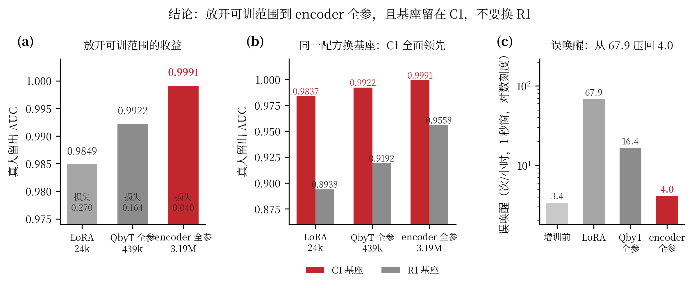

### 7.5 基座选择：留在 C1

同一个配方换基座，差距立刻出现。

| 可训范围 | C1 基座 | R1 基座 |
|---|---|---|
| 仅匹配器注意力 | 0.9837 | 0.8938 |
| QbyT 全参 | 0.9922 | 0.9192 |
| encoder 与 QbyT 全参 | 0.9991 | 0.9558 |

R1 基座在增训前的真实域上确实更好（AUC 0.7114 对 0.6085），但它的编码器可塑性下降，放开全参也只到 0.9558，而 C1 到 0.9991。近音词误触发同样分开：C1 全参版 0.039，R1 放开版 0.283。结论是通用指标最好不代表适合做产品基座。

增训不是一次做对的，中间换过三次判断，过程见表 7-2，最后一行是换编码器系的复核。

| 轮次 | 做法 | 结果 | 判断与修正 |
|---|---|---|---|
| 一 | C1 基座加 LoRA，rank 16，学习率 4e-4，2,100 步 | 真人 AUC 0.9849，训练损失 0.270 | 可用，成为初版交付 |
| 二 | 同样配方换 R1 基座 | 真人 AUC 0.8938，训练损失 0.618 | 怀疑 R1 的编码器被通用训练特化 |
| 三 | R1 基座加容量与学习率，rank 64、1e-3，跑满 2,100 步 | 0.9011，损失仍是 0.618 | 容量与学习率都不是瓶颈 |
| 四 | R1 基座换成匹配器全参 439k | 0.9192 | 冻结编码器下的上限约 0.92 |
| 五 | R1 基座再放开编码器，lr 5e-5 | 0.9558，1 秒窗误唤醒 5.06，近音词 0.283 | 放开编码器才有量级变化，但近音词代价高 |
| 六 | 回到 C1 基座，逐步放开可训范围 | 0.9849 到 0.9922 到 0.9991 | 纠正早先“容量不是瓶颈”的误判，交付 c1_encfull |
| 七 | 换 GS-base 流式编码器系，配方与第六轮逐项相同 | 放开全参真人 AUC 0.9758，近音词 0.257，通用能力 0.9137 | 配方可迁移，近音词与通用能力仍输 C1，基座选择不变 |

第五轮和第六轮合起来给出最终结论：决定成败的是编码器的可塑性，不是匹配器的容量，也不是通用指标的高低。

编码器的来历做了逐元素比对，脚本是 `scripts/compare_encoder_provenance.py`，结果见附录 H。SS-zh-en 与上游 zh-en-3M 的 327 个 encoder 张量最大差是 0，C1 的编码器在本仓库里从未被训练过。R1-bare 与上游的最大差是 1.0997，SS-R1 与 R1-bare 是 0，R1 那 13.3k 步确实动了编码器，SS-R1 继承的就是动过的那一版。两边的可塑性差异因此有了明确的来源，它在近音词一列上最明显，第 7.8 节给出了三系对照。

### 7.6 增训效果

交付模型在三个域上的表现如下。

| 评测域 | 增训前 | 交付模型 |
|---|---|---|
| 真人留出说话人 AUC | 0.6085 | 0.9991 |
| 真人 EER | 39.49% | 1.05% |
| TTS 留出音色 AUC | 0.8228 | 0.9956 |
| 通用能力 LibriPhrase AUC | 0.9411 | 0.9413 |
| 阈值 0.5 真人召回 / 误触发 | 0.217 / 0.166 | 0.991 / 0.016 |

通用能力没有掉，反而比基座略高。阈值 0.5 下的误触发从 16.6% 降到 1.6%。

### 7.7 标准口径与部署工作点

前面的对照表换过几次口径，容易读混。从这一版起固定一套标准，之后的数字都按它出。

阈值只由通用背景定。取留出的 MUSAN 音乐噪声网格 43.7 小时，加 LibriSpeech other-500 子集 82.7 小时，合成一个 126.4 小时的池子，目标误唤醒预算就是池子上的误报率。定完阈值再读真人留出与 TTS 留出的唤醒率。近音词只报告，不参与定阈值，因为公开语料里没有这一类，把它并进去等于拿唤醒率换一个别人无法复现的数字。

表里区分两件事。基础 encoder 是编码器的来历，增训时 encoder 指这次增训它是否参与梯度更新。C1 与交付模型的基础 encoder 都是 zh-en-3M 原始版本，R1 系继承 R1 微调过的版本，GS-base 系来自 GS-base 原始版本。来历用逐元素比对确认，最大差 0 表示这份编码器在本仓库里从未被训练过，见附录 H。

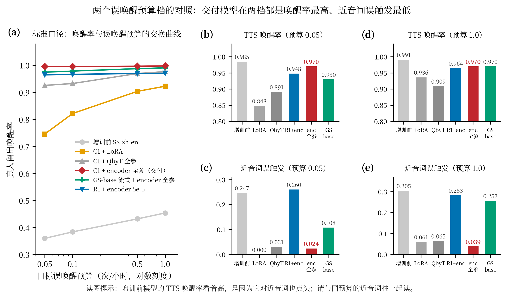

| 模型 | 预算 0.05 真人唤醒 | 预算 0.05 TTS 唤醒 | 预算 0.05 近音词 | 预算 1.0 真人唤醒 | 预算 1.0 近音词 |
|---|---|---|---|---|---|
| 增训前 | 0.360 | 0.985 | 0.247 | 0.454 | 0.305 |
| LoRA | 0.746 | 0.848 | 0.000 | 0.923 | 0.061 |
| QbyT 全参 | 0.926 | 0.891 | 0.031 | 0.977 | 0.065 |
| R1 放开 encoder | 0.965 | 0.948 | 0.260 | 0.971 | 0.283 |
| GS-base + QbyT 全参 | 0.799 | 0.891 | 0.033 | 0.909 | 0.086 |
| GS-base + encoder 全参 | 0.975 | 0.930 | 0.108 | 0.991 | 0.257 |
| 交付模型 | 0.996 | 0.970 | 0.024 | 0.998 | 0.039 |

两个读法。增训前模型的 TTS 唤醒率看着最高，是因为它对什么都点头，同预算的近音词误触发是全场最差，两个指标必须一起读。交付模型在两个预算档上都是唤醒率最高、近音词误触发最低。

### 7.8 换编码器系复核：GS-base 流式

交付模型的基座是 zh-en-3M 系的 C1。第 3 章的方差分解说编码器解释 94% 的 AUC 方差。这里回答一个具体问题：这套增训配方有多少来自配方本身，有多少来自编码器系。

GS-base 流式编码器取自作者发布的 GigaSpeech KWS 基座检查点。它在第 3 章的读出阶梯上已经同场比过，v2 读出 0.9271，比 zh-en-3M 的 0.9376 低一档。增训配方与交付模型逐项相同：joint 固定配额，2,100 步，匹配器学习率 1e-4，编码器学习率 5e-5，batch 64，采样权重与随机种子都不变，只有起点不同。两个可训范围各跑一臂。

| 基座与可训范围 | 真人 AUC | 真人 EER | 预算 0.05 真人唤醒 | 预算 1.0 真人唤醒 | 预算 0.05 近音词 | 预算 1.0 近音词 | 通用能力 |
|---|---|---|---|---|---|---|---|
| C1 + QbyT 全参（冻结） | 0.9922 | 4.29% | 0.926 | 0.977 | 0.031 | 0.065 | 0.9300 |
| C1 + encoder 与 QbyT 全参（交付） | 0.9991 | 1.05% | 0.996 | 0.998 | 0.024 | 0.039 | 0.9413 |
| GS-base 流式 + QbyT 全参 | 0.9487 | 8.74% | 0.799 | 0.909 | 0.033 | 0.086 | 0.9025 |
| GS-base 流式 + encoder 与 QbyT 全参 | 0.9758 | 6.37% | 0.975 | 0.991 | 0.108 | 0.257 | 0.9137 |

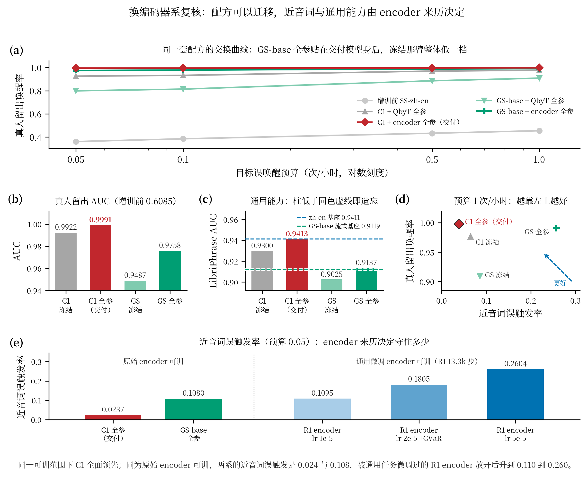

图 7-4 把交付模型与三个对照放在一起。面板 (a) 是标准口径的交换曲线，四条曲线加增训前参照；面板 (b) 是真人留出 AUC；面板 (c) 是通用能力，两条虚线是每个编码器系增训前的旧任务水平，蓝线是 zh-en 基座的 0.9411，绿线是 GS-base 流式基座的 0.9119（附录 B 里 GS-base 流式 v4.1 那一格），柱子低于同色虚线才算忘了旧任务。同色对比下 C1 全参 0.9413 与基座持平，GS 全参 0.9137 比自己的基座高 0.2 个百分点，两个冻结臂各低 1.1 和 0.9 个百分点。GS-base 与 zh-en 之间那 2.9 个百分点是基座本身的差距，不是增训造成的。面板 (d) 是 1 次/小时预算下的取舍，横轴近音词误触发，纵轴真人唤醒率，越靠左上越好。面板 (e) 把所有放开 encoder 的臂按 encoder 来历分成两组，比预算 0.05 下的近音词误触发。

四个读法。放开编码器在两个编码器系上都有效。GS-base 的真人 AUC 从 0.9487 抬到 0.9758，通用能力从 0.9025 抬到 0.9137，预算 0.05 下的唤醒率从 0.799 抬到 0.975。C1 的同一组比较是 0.9922 到 0.9991、0.9300 到 0.9413，方向一致。

同一个可训范围下换系，C1 全面领先。冻结对冻结，AUC 0.9922 对 0.9487，预算 0.05 唤醒 0.926 对 0.799，通用能力 0.9300 对 0.9025。放开对放开，AUC 0.9991 对 0.9758，预算 0.05 唤醒 0.996 对 0.975，通用能力 0.9413 对 0.9137。

差距最小的是 GS-base 放开全参在 1 次/小时预算下的唤醒率，0.991 对交付模型的 0.998。同一档近音词误触发是 0.257 对 0.039，通用能力低 2.8 个百分点，不过这一截主要是基座本身的差距，GS-base 全参相对它自己的基座并没有掉。配方可以迁移，编码器系决定上限。

第四个读法要借附录 G 的整张表。放开 encoder 的臂里只有两行的基础 encoder 是原始版本，C1 全参和 GS-base 全参，预算 0.05 下的近音词误触发是 0.0237 和 0.1080。基础 encoder 被通用任务微调过 13.3k 步的 R1 系放开 encoder 后，这一列是 0.1095、0.1805、0.2604。

最干净的一组对照是 encoder 学习率同为 5e-5 的三个臂，C1 全参、GS-base 全参、R1 的 lr5e-5。它们的 adapt_method、匹配器学习率、warmup、步数、batch、采样权重与种子逐项相同，只有 encoder 的来历不同，近音词误触发是 0.0237、0.1080、0.2604。R1 另外两臂把 encoder 学习率降到 1e-5 与 2e-5（2e-5 那臂还加了 CVaR 权重），近音词误触发回到 0.1095 与 0.1805，代价是唤醒率掉到 0.870 与 0.936，5e-5 那臂是 0.965。encoder 之前被通用任务动过，增训就更难同时保住唤醒率和近音词判别力。图 7-4 面板 (e) 是这五根柱。

工程侧有一个容易踩的坑。GS-base 系的卷积核是 31,31,15,15,15,31，zh-en 系是 15,15,15,15,15,15。训练和评测都要带 `stage1.cnn_module_kernel` 覆盖，只改训练不改评测，评测会重建出错误的编码器结构，然后在每个背景网格上静默失败。

### 7.9 消融：三个该做与不该做的决定

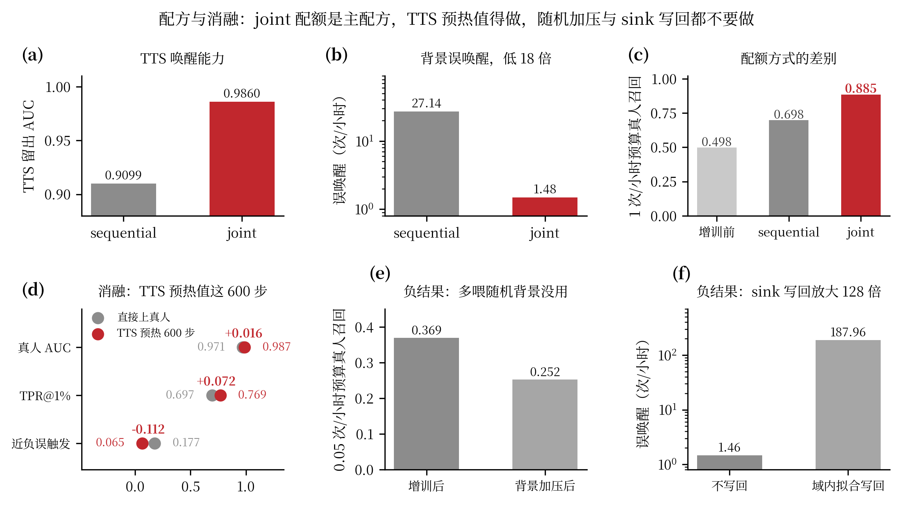

joint 配额是主配方，前面已给数字。TTS 预热值得做。同样的真人阶段预算，加 600 步 TTS 预热后 AUC 从 0.9709 提到 0.9870，低误报尾部从 0.6967 提到 0.7690，近负误触发从 0.1775 减到 0.0651。合成语料的作用是把匹配器先带到正确区域，再由真人数据收尾。

两个决定不要做。随机背景加压没有修好分数先验，反而每个维度都更差，0.05 预算下的召回从 0.369 掉到 0.252。sink 头写回是域相关操作，用通用域拟合会拿部署域换通用域，用真人训练说话人拟合会让 MUSAN 误唤醒放大到 187.96 次/小时。头增益本身只有千分之一到千分之二，不值得承担域错位风险。

### 7.10 部署红线

四条部署红线与实测依据见表 7-3。

| 红线 | 实测依据 |
|---|---|
| 打分窗口不低于 1 秒 | 0.5 秒窗下每窗口误触发率涨 8 倍，单位时间窗口数涨 6 倍，合起来 MUSAN 误唤醒涨 48 倍 |
| 不要靠补静音提召回 | 真人音频中位 2.44 秒，补到 2.0 秒持平，补到 3.0 秒召回掉 2.8 个百分点 |
| 上线前重标定阈值 | 增训改变分数分布，沿用旧阈值同时损失召回并抬高误唤醒 |
| 挖掘语料与评测集不相交 | 否则误唤醒复测变成 in-sample，数字不可信 |

推荐做法是用 2 到 3 秒窗口配小跳步滑窗取最大分。

### 7.11 交付与下一步

交付模型是 C1 基座加 encoder 与 QbyT 全参、joint 配额的版本，路径 `data/dma-kws/exp/stage2_adapt_v42/c1_encfull/stage2_adapted.pt`。次选是编码器冻结版本 `c1_qbytfull`，参数 439k，省显存。原 LoRA 版保留为对照。

第 7.8 节的复核指向同一处。换编码器系后唤醒率基本追平，差的是近音词与通用能力，要动的是负样本构成，不是编码器。

下一步唯一能继续压低近音词误触发的方法是硬负样本挖掘。做法是把背景池里那 0.1% 得高分窗口切成片段，显式作为负样本重训。有一个方法学要求，挖掘语料必须与误唤醒评测集不相交，否则复测变成 in-sample，数字不可信。

## 第 8 章 结论

### 8.1 收益总账

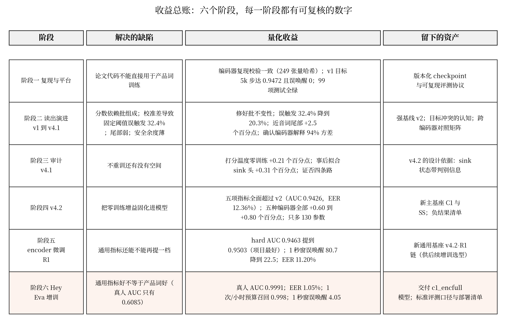

### 8.2 四条经验

每一级升级都要有缺陷驱动和数字。读出层的每一档改动都能对应到一个实测缺陷，校准差、尾部弱、安全余度薄，没有为了改而改的动作。

强基线要一直摆在桌上。v2 从第 3 章一路领先到第 5 章才被 v4.2 超过，我们从来没有换一个更好看的对照来宣称成绩。

负结果是排雷。混合池化、可学习训练温度、正弦位置编码、sink 损失进主训练、关闭 CVaR、随机背景加压、sink 头写回、从零跑 100:1、换 GS-base 流式编码器系，这些路都被实验排除并留下记录，后续不需要重复试错。

挑基座要先看 encoder 的来历。同样是原始 encoder 的 C1 与 GS-base，放开 encoder 后预算 0.05 的近音词误触发是 0.024 与 0.108；被通用任务训过 13.3k 步的 R1 系，同样放开是 0.110 到 0.260。encoder 之前被别的任务动过，增训就很难把它拉回产品词需要的判别力，这一步要在选型时看，不要等训完再发现。

### 8.3 交付物

交付清单见表 8-1。

| 交付物 | 路径 | 说明 |
|---|---|---|
| 交付模型 | data/dma-kws/exp/stage2_adapt_v42/c1_encfull/stage2_adapted.pt | C1 基座，encoder 与 QbyT 全参，joint 配额 |
| 次选模型 | data/dma-kws/exp/stage2_adapt_v42/c1_qbytfull/stage2_adapted.pt | 编码器冻结，439k 参数，省显存 |
| 对照模型 | data/dma-kws/exp/stage2_adapt_v42/hey_eva_joint/stage2_adapted.pt | 原 LoRA 方案，保留对照 |
| 换系复核模型 | data/dma-kws/exp/stage2_adapt_v42/gsstream_encfull/stage2_adapted.pt | GS-base 流式基座，验证配方可迁移性，见 7.8 节 |
| 标准口径表 | docs/hey-eva-operating-points.md | 一条命令可重算 |
| Encoder 来历比对 | docs/encoder-provenance.md | 一条命令可重算，见附录 H |
| 方法与结果文档 | docs/qbyt-v4.2-design.md，docs/hey-eva-adaptation-strategy.md | 全部实验细节 |
| 本报告与图 | docs/report/，含 gen_report_figs.py | 14 张图一条命令重出 |

## 附录

### 附录 A 术语表

| 术语 | 含义 |
|---|---|
| QbyT | 论文的文本查询匹配器，第二阶段的可训部分 |
| 读出 | 把逐位置分数聚合成整句分数的结构 |
| sink 令牌 | 加入序列、用于吸收注意力并承载判别信息的一个额外位置 |
| hard 验证集 | LibriPhrase 的困难划分，270,684 个文本音频对，本项目主指标来源 |
| AUC / EER | 排序能力 / 错误率等于漏检率时的错误率 |
| TPR@1%FPR | 只允许 1% 误报时能召回的真样本比例 |
| FA/h | 每小时误唤醒次数 |
| 近音词 | 与唤醒词发音接近的词，公开语料里没有，需要单独构造 |
| 正类先验 | 训练批次里正样本的比例，会整体平移分数 |

### 附录 B 15 次全量对照矩阵

AUC 与 EER，冻结编码器加 42 万可训头，LibriSpeech 加 GigaSpeech 1460 小时，硬负样本 1:1，MUSAN 背景 25%，batch 128，50k 步。

| 编码器 | v2 | v3 | v4 | v4.1 |
|---|---|---|---|---|
| zh-en-3M 流式 | 0.9376 / 12.86 | 0.9316 / 13.22 | 0.9323 / 13.36 | 0.9350 / 13.11 |
| GS-base 流式 | 0.9271 / 14.11 | 0.9064 / 16.30 | 0.9131 / 15.70 | 0.9119 / 15.95 |
| GS-KWS 微调 流式 | 0.8809 / 19.58 | 0.8598 / 21.67 | 0.8565 / 21.96 | 0.8687 / 20.77 |
| GS-base 全上下文 | 未跑 | 0.9136 / 15.72 | 0.9195 / 14.79 | 0.9129 / 15.63 |

### 附录 C 负结果清单

| 负结果 | 关键数字 |
|---|---|
| 混合池化（mixture） | 两轮消融 dAUC −0.0047 / −0.0057 |
| 可学习训练温度 | 0.93453 对固定温度 0.93455，无差别 |
| 训练期改温度 | 离线预计 +0.0018 未兑现 |
| 正弦文本位置编码 | 零训练替换 0.93501 掉到 0.70264；从零 50k 为 0.92973 |
| sink 损失进主训练 | C3 从零 50k 为 0.93027，低于 C1 的 0.93785 |
| 关闭 CVaR 从零训练 | 0.93450，低于 C1 |
| 随机背景加压 | 0.05 预算召回 0.369 掉到 0.252 |
| sink 头写回 | 域内拟合让 MUSAN 3 秒窗误唤醒从 1.46 涨到 187.96 |
| 从零跑 100:1 | 5k 步 AUC 0.672，触发熔断 |
| 3k 短程解冻 | 四组全部低于基座 0.94106 |
| 换 GS-base 流式编码器系 | 放开全参真人 AUC 0.9758，近音词误触发 0.257，通用能力 0.9137；交付模型是 0.9991 / 0.039 / 0.9413 |

### 附录 D 消融全记录

| 轮次 | 设置 | 结果 |
|---|---|---|
| A 轮 | v4.1 基座热身 2k 步，lr 5e-5 | A0 对照 0.93422；additive 0.93419；mixture 0.92956；固定温度 0.1 为 0.93455；可学习温度 0.93453；sink 身份 0.93395 |
| B 轮 | 同基座，lr 2e-4 | 对照 0.93265；additive-zero 0.93282；mixture-zero 0.92694；additive-zero 加温度 0.1 为 0.93330 |
| S 轮 | C1 基座热身 2k 步 | S0 对照 0.93645；S1（bce 0.25）0.93764；S2（bce 0.5）0.93773 |
| E1 | C1 基座热身 2k 步，关闭 CVaR | 0.93802，短程正向，从零训练时反向 |
| C 系 | 从零 50k | C1 0.93785；C2 正弦位置 0.92814；C3 加 sink 损失 0.93027；C1 关 CVaR 0.93450 |
| U 与 H | 从 v4.2 基座热身 3k | U1 0.93423；U2 0.93966；H1 0.93948；H2 0.93767 |
| R1 链 | 从 C1 续训 | 裸 0.94630；加 sink 头 0.94779；加写回 0.95028 |

### 附录 E 复现命令与文件索引

训练与评测用 Hydra 配置驱动，示例命令和完整参数见 `docs/qbyt-v4.2-design.md` 与 `docs/hey-eva-adaptation-strategy.md`。标准口径对照表一条命令重算：

```bash
.venv/bin/python scripts/report_wake_fa_operating_points.py --out docs/hey-eva-operating-points.md
```

本报告图表一条命令重出：

```bash
.venv/bin/python docs/report/gen_report_figs.py
```

换编码器系训练时要同时给训练和评测传 `stage1.cnn_module_kernel` 覆盖，GS-base 系是 31,31,15,15,15,31，zh-en 系是 15,15,15,15,15,15。只改训练不改评测，评测会重建出错误的编码器结构。完整命令见 `docs/hey-eva-adaptation-strategy.md` 6.12 节。

encoder 来历比对一条命令重算，输出见附录 H：

```bash
.venv/bin/python scripts/compare_encoder_provenance.py --out docs/encoder-provenance.md
```

主要数据来源：各 run 的 `metrics.csv`；离线探针的 `analysis.json` 与 `probe.npz`；误唤醒评测的 `summary.json` 与阈值曲线 CSV；增训评测的 `outputs/hey_eva_v42_eval/`。

### 附录 F 与论文逐项对照

| 项目 | 论文或作者发布 | 本项目 |
|---|---|---|
| 复现的两阶段结构 | 冻结编码器加文本查询匹配器 | 一致，编码器哈希校验通过 |
| v1 目标加背景负样本 | 作者联合训练 0.9595，误唤醒 2266 次/24 小时 | 5k 步 0.9472，误唤醒 0 |
| 长程训练规模 | 约 4.1 亿样本 | 640 万到 1,000 万样本，受算力限制 |
| 同任务对照 | DS-KWS M1 0.9577（冻结），M2 0.9785（可训练编码器）；KFC-KWS 0.9765 | 本项目冻结编码器最好 0.9503 |

论文与对照系统的分数仍高于我们，主要原因在训练规模与级联结构，不在读出结构。第 3 章的方差分解支持这个判断。

### 附录 G 标准口径完整对照表

阈值只由通用背景池（MUSAN 43.7 小时加 LibriSpeech other-500 子集 82.7 小时，合计 126.4 小时）确定，近音词只报告，不参与定阈值。数据由 `scripts/report_wake_fa_operating_points.py` 生成。

基础 encoder 是编码器的来历，增训时 encoder 指这次增训它是否参与梯度更新，来历的逐元素比对见附录 H。

预算 0.05 次/小时。

| 模型 | 基础 encoder | 增训时 encoder | 真人唤醒率 | TTS 唤醒率 | MUSAN FA/h | LibriSpeech FA/h | 近音词误触发 | 通用能力 |
|---|---|---|---|---|---|---|---|---|
| 增训前 SS-zh-en | zh-en-3M 原始 | 未增训 | 0.360 | 0.985 | 0.046 | 0.048 | 0.247 | 0.9411 |
| 增训前 SS-R1 | zh-en-3M + R1 微调 13.3k 步 | 未增训 | 0.076 | 0.858 | 0.023 | 0.060 | 0.046 | 0.9478 |
| C1 + LoRA | zh-en-3M 原始 | 冻结 | 0.746 | 0.848 | 0.137 | 0.000 | 0.000 | 0.9300 |
| C1 + QbyT 全参 | zh-en-3M 原始 | 冻结 | 0.926 | 0.891 | 0.114 | 0.012 | 0.031 | 0.9300 |
| C1 + encoder 与 QbyT 全参（交付） | zh-en-3M 原始 | 可训 | 0.996 | 0.970 | 0.114 | 0.012 | 0.024 | 0.9413 |
| R1 + LoRA | zh-en-3M + R1 微调 | 冻结 | 0.718 | 0.967 | 0.137 | 0.000 | 0.093 | 0.9393 |
| R1 + QbyT 全参 | zh-en-3M + R1 微调 | 冻结 | 0.880 | 0.939 | 0.091 | 0.024 | 0.210 | 0.9417 |
| R1 + encoder lr1e-5 | zh-en-3M + R1 微调 | 可训 | 0.870 | 0.936 | 0.137 | 0.000 | 0.110 | 0.9462 |
| R1 + encoder lr2e-5 加 CVaR | zh-en-3M + R1 微调 | 可训 | 0.936 | 0.942 | 0.137 | 0.000 | 0.181 | 0.9469 |
| R1 + encoder lr5e-5 | zh-en-3M + R1 微调 | 可训 | 0.965 | 0.948 | 0.114 | 0.012 | 0.260 | 0.9484 |
| GS-base 流式 + QbyT 全参 | GS-base 原始 | 冻结 | 0.799 | 0.891 | 0.114 | 0.012 | 0.033 | 0.9025 |
| GS-base 流式 + encoder 与 QbyT 全参 | GS-base 原始 | 可训 | 0.975 | 0.930 | 0.137 | 0.000 | 0.108 | 0.9137 |

预算 1.0 次/小时。

| 模型 | 基础 encoder | 增训时 encoder | 真人唤醒率 | TTS 唤醒率 | MUSAN FA/h | LibriSpeech FA/h | 近音词误触发 | 通用能力 |
|---|---|---|---|---|---|---|---|---|
| 增训前 SS-zh-en | zh-en-3M 原始 | 未增训 | 0.454 | 0.991 | 0.229 | 1.402 | 0.305 | 0.9411 |
| 增训前 SS-R1 | zh-en-3M + R1 微调 13.3k 步 | 未增训 | 0.088 | 0.873 | 0.206 | 1.415 | 0.055 | 0.9478 |
| C1 + LoRA | zh-en-3M 原始 | 冻结 | 0.923 | 0.936 | 2.585 | 0.157 | 0.061 | 0.9300 |
| C1 + QbyT 全参 | zh-en-3M 原始 | 冻结 | 0.977 | 0.909 | 1.944 | 0.496 | 0.065 | 0.9300 |
| C1 + encoder 与 QbyT 全参（交付） | zh-en-3M 原始 | 可训 | 0.998 | 0.970 | 0.846 | 1.076 | 0.039 | 0.9413 |
| R1 + LoRA | zh-en-3M + R1 微调 | 冻结 | 0.872 | 0.985 | 1.807 | 0.568 | 0.250 | 0.9393 |
| R1 + QbyT 全参 | zh-en-3M + R1 微调 | 冻结 | 0.943 | 0.958 | 1.944 | 0.496 | 0.396 | 0.9417 |
| R1 + encoder lr1e-5 | zh-en-3M + R1 微调 | 可训 | 0.899 | 0.985 | 0.961 | 1.016 | 0.201 | 0.9462 |
| R1 + encoder lr2e-5 加 CVaR | zh-en-3M + R1 微调 | 可训 | 0.944 | 0.967 | 0.938 | 1.028 | 0.206 | 0.9469 |
| R1 + encoder lr5e-5 | zh-en-3M + R1 微调 | 可训 | 0.971 | 0.964 | 0.846 | 1.076 | 0.283 | 0.9484 |
| GS-base 流式 + QbyT 全参 | GS-base 原始 | 冻结 | 0.909 | 0.955 | 2.608 | 0.145 | 0.086 | 0.9025 |
| GS-base 流式 + encoder 与 QbyT 全参 | GS-base 原始 | 可训 | 0.991 | 0.970 | 1.510 | 0.725 | 0.257 | 0.9137 |

增训前的两个基座在 TTS 上唤醒率很高，是因为它们对近音词的误触发也高（0.247 与 0.305），两个指标要一起看。GS-base 流式这一系两臂都在表里：同一可训范围下它全面落后 C1，冻结对冻结的 0.05 预算唤醒率是 0.799 对 0.926，通用能力 0.9025 对 0.9300。

### 附录 H Encoder 来历比对

比对方法与原始输出见 `docs/encoder-provenance.md`，由 `scripts/compare_encoder_provenance.py` 生成。最大差 0 表示该 checkpoint 的 327 个 encoder 张量逐元素等同于右侧，即这份编码器在本仓库里从未被训练过。

| 比对 | 逐元素最大差 | 最大差位置 |
|---|---|---|
| SS-zh-en 对上游 zh-en-3M | 0 | 无差异 |
| SS-gsbase-stream 对上游 GS-base | 0 | 无差异 |
| SS-R1 对上游 zh-en-3M | 1.0997 | `encoder.encoders.3.encoder.layers.0.norm.bias` |
| SS-R1 对 R1-bare | 0 | 无差异 |

读法。C1 与交付模型的编码器继承自作者发布的 zh-en-3M，本仓库没有动过它，所以第 7.5 节的可塑性判断针对的是基座本身。R1 的编码器经过 13.3k 步通用训练后与上游差出 1.0997，SS-R1 继承的就是这一版。
