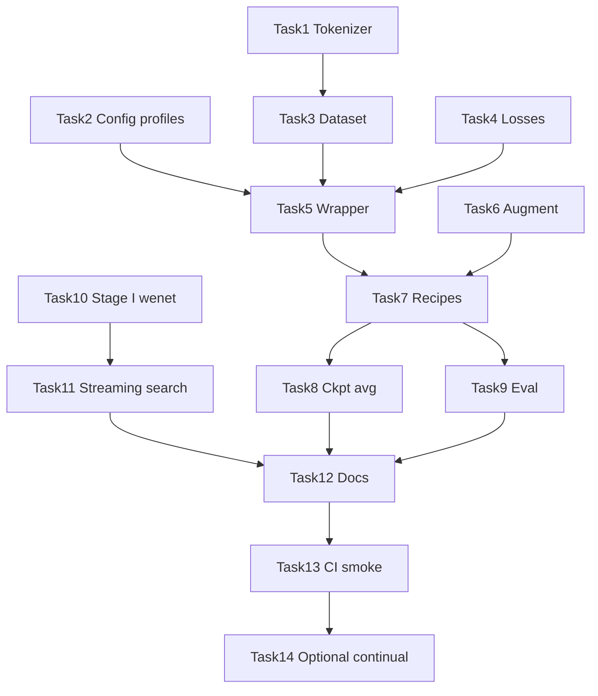

# Main 实验代码完整对齐 Implementation Plan

> **For agentic workers:** REQUIRED SUB-SKILL: Use superpowers:subagent-driven-development (recommended) or superpowers:executing-plans to implement this plan task-by-task. Steps use checkbox (`- [ ]`) syntax for tracking.

**Goal:** 让当前代码训出的模型与 `main` 论文源代码、论文原文描述的方法**完全一致**——同一套训练逻辑、损失、数据构造、推理与评测；**不允许**因「demo 捷径」导致模型行为与论文分叉。`demo_librispeech100.yaml` 仅表示**小规模 smoke**（更少数据/步数），不表示另一套算法。

**Architecture:** **单一训练路径（Single Recipe）**。把 `main` 上 `qbyt/train*.py`、`qbyt/dataset/*` 的行为抽取到 `dma_kws/stage1/`、`dma_kws/stage2/`；`scripts/*` 只做 CLI。YAML 只配置**规模**（数据集大小、max_steps、batch、GPU 数）和**路径**，不配置「是否用 seq_loss / hard neg / streaming search」等会改变模型行为的开关。`qbyt/model.py` 保留 padding-aware 修复（相对 main 的正确性补丁，不改变论文方法定义）。

**Tech Stack:** Python 3.10, PyTorch, PyTorch Lightning, torchaudio, transformers (cosine warmup), torchmetrics, pandas/pyarrow, g2p_en, vendored `qbyt/models/*`, Wenet CTC search (`ctc_prefix_beam_search`, `ContextGraph`).

## Global Constraints

- **Single Recipe 原则：** 全仓库只有一套训练/推理实现；禁止 `mode: demo` 与 `mode: paper` 在损失、负样本、tokenizer、Stage I 搜索上走不同代码路径。
- **Scale-only 预设：** `demo_librispeech100.yaml` 与 `paper_ls460.yaml` 的区别仅限数据子集、步数、batch、路径；算法字段必须相同。
- 所有路径必须来自 YAML config，禁止新增 `/nvme01/openkws/...` 硬编码。
- 模型超参与 `main` 一致：`ConformerEncoder` 80→144, 6 blocks, 4 heads, 576 units；`QbyT` embed_dim=128, post_num_layers=2, num_embeds=73。
- 词表/tokenizer 统一为 Wenet `CharTokenizer` + `lang_char.txt`（废弃训练路径上的 `PhonemeVocabulary` + 独立 g2p 词表）。
- Stage II 损失固定为 `utt_loss + seq_loss`；负样本固定为 random + hard（比例可随 recipe 配置，但机制不可关）。
- Stage I 推理默认 `ctc_prefix_beam_search` + `ContextGraph`（与论文 dual-stage matching 一致）。
- 保留 pytest 全部通过；smoke 仍可用 `--limit-steps 20`，但走的是**同一套**训练代码。
- **验收标准：** 在 LibriPhrase-460 hard 上，复现 `main` 流水线（init → avg_10 → finetune → eval）的 AUC/EER 与 `main` 同配置差距 < 1% absolute；小规模 preset 只验证「能跑通」，不用于声称论文指标。
- 不在本计划内分发作者预训练 checkpoint；只实现与论文源代码等价的可复现流水线。

## 与论文原文的一致性对照

| 论文/main 要求 | 当前 demo 分叉点 | 对齐后 |
|----------------|------------------|--------|
| Dual-stage: CTC phoneme search → QbyT verify | offline greedy + 子串 | prefix beam + ContextGraph → QbyT |
| QbyT 多模态 phoneme matching | 仅 utt BCE | utt + seq（音素级辅助） |
| LibriPhrase hard negatives | 随机负样本 | distances_file hard neg |
| Stage I 大规模 phoneme CTC（Wenet g2p） | LibriSpeech-100 自建 CTC | Wenet librispeech-g2p recipe |
| 训练 schedule / DDP / ckpt avg | 简化 Adam 单阶段 | 与 main 相同 |
| LibriPhrase hard 97.85% AUC | 无等价评测 | `eval_stage2_libriphrase.py` hard split |

**结论：** 只要上述任一项仍用 demo 简化版，训出的模型就与论文源代码/论文结果不一致；本计划的目标是消除这些分叉，而非并行保留两套模型行为。

## Invariant vs Scale（用户确认原则）

**可以相对论文缩小（仅影响收敛与最终指标，不改变方法）：**

- 数据子集：LibriSpeech-100 / LibriPhrase-100 代替 460 / GigaPhrase-1460
- 训练步数、`sample_lens`、batch size、GPU 数量
- smoke 用的 `--limit-steps`、`--limit-anchors`

**必须与论文源代码 / main 保持一致（不可因 demo 而简化）：**

- 模型架构：ConformerEncoder + CTC（Stage I）；ConformerEncoder + QbyT（Stage II）
- 训练 Loss：Stage II 固定 `utt_loss + seq_loss`
- 负样本机制：random + hard（`distances_file`，比例随 recipe 配置）
- Tokenizer / 词表：Wenet `CharTokenizer` + `lang_char.txt`
- 特征：预计算 fbank `.npy`（与 main 相同提取方式）；增强策略一致
- 优化器：Adam + cosine warmup（超参与 main recipe 一致，仅 total steps 可缩短）
- Stage I 推理：prefix beam + ContextGraph（非 greedy 子串）
- 训练阶段：init → checkpoint avg → finetune（recipe 链与 main 同构）
- 评测：LibriPhrase hard/easy AUC/EER（小数据集可跑通流程，论文数字需 full scale）

小数据集训出的 checkpoint **方法上与论文一致**，但 **数值上不应声称等于论文 SOTA**。

---

| 领域 | demo 现状 | main 目标 |
|------|-----------|-----------|
| 词表/tokenizer | `PhonemeVocabulary` + g2p_en | Wenet `CharTokenizer` + `lang_char.txt` |
| Stage I 训练 | 自建 CTC runner | Wenet `librispeech-g2p` recipe + avg checkpoint |
| Stage I 推理 | greedy CTC + 子串搜索 | `ctc_prefix_beam_search` + `ContextGraph` keyword graph |
| Stage II 损失 | 仅 `utt_loss` | `utt_loss + seq_loss` |
| Stage II 负样本 | 随机 1:1 | random + hard（`distances_file`, ratio 最高 100:1） |
| Stage II 特征 | 在线 fbank | 预计算 fbank `.npy` + 可选 augment |
| 优化器 | Adam 1e-3 常数 | Adam 5e-4/1e-3 + cosine warmup |
| 分布式 | 单/多卡 Lightning | DDP + accumulate_grad_batches=2 |
| 训练阶段 | 单阶段 | init → finetune → frozen-encoder 变体 |
| 评测 | demo JSON | LibriPhrase hard/easy AUC/EER |
| checkpoint | 单 ckpt | 末 10 步 avg（`avg_10.ckpt`） |

## File Map（新增/修改）

```
configs/
  demo_librispeech100.yaml          # 保留：仅 scale smoke（LP-100 + 少步数），算法同 paper
  paper_ls460.yaml                  # 论文复现：init-ls-460
  paper_ls_gs1460.yaml              # 论文复现：ft-ls-gs-1460
data/
  dict/lang_char.txt                # repo-canonical Wenet phoneme dict (73 tokens)
  dict/README.md                    # vendored vocab docs + retrain warning
dma_kws/
  tokenizer.py                      # 新增，CharTokenizer 包装 + 路径注入
  stage1/
    wenet_ctc.py                    # 新增，Stage I 训练/解码对齐 wenet
    streaming_search.py             # 新增，ContextGraph + prefix beam
  stage2/
    dataset.py                      # 新增，LibriPhrase train/test dataset
    losses.py                       # 新增，utt + seq loss
    module.py                       # 新增，Lightning Wrapper（对齐 main）
    collate.py                      # 新增，train/test collate
  training/
    scheduler.py                    # 新增，cosine warmup 工厂
    checkpoint_avg.py               # 新增，Lightning ckpt 平均
    ddp.py                          # 新增，Trainer kwargs 工厂
scripts/
  prepare_stage1_wenet.sh           # 新增，包装 wenet g2p 数据准备
  train_stage1_ctc.py               # 修改，统一 Wenet-aligned Stage I（demo 仅 scale）
  train_stage2_qbyt.py              # 修改，委托 dma_kws.stage2.module
  eval_stage2_libriphrase.py        # 新增，hard/easy AUC/EER
  run_two_stage_demo.py             # 修改，支持 streaming Stage I
  average_checkpoints.py            # 新增
tests/
  test_tokenizer.py
  test_lang_char_dict.py
  test_stage2_losses.py
  test_stage2_dataset.py
  test_stage2_collate.py
  test_checkpoint_avg.py
  test_streaming_search.py
```

---

## Phase 0 — 配置与 Tokenizer 对齐

### Task 1: 引入 Wenet 词表与 CharTokenizer 包装

**Files:**
- Create: `data/dict/lang_char.txt`
- Create: `dma_kws/tokenizer.py`
- Create: `tests/test_tokenizer.py`
- Modify: `configs/demo_librispeech100.yaml`

**Interfaces:**
- Consumes: `qbyt/models/text/char_tokenizer.py` (`CharTokenizer`)
- Produces:
  - `load_char_tokenizer(dict_path: Path) -> CharTokenizer`
  - `tokenize_phoneme_string(tokenizer, g2p_text: str) -> list[int]`
  - `build_seq_label(anchor_ids: list[int], query_ids: list[int]) -> list[int]`

- [ ] **Step 1: 写入失败测试**

```python
# tests/test_tokenizer.py
from pathlib import Path
from dma_kws.tokenizer import load_char_tokenizer, tokenize_phoneme_string, build_seq_label

def test_tokenize_phoneme_string_matches_main_style(tmp_path):
    dict_path = Path("data/dict/lang_char.txt")
    tok = load_char_tokenizer(dict_path)
    ids = tokenize_phoneme_string(tok, "HH AH L OW")
    assert isinstance(ids, list)
    assert all(isinstance(x, int) for x in ids)

def test_build_seq_label_membership():
    anchor = [10, 11, 12]
    query = [11, 99]
    assert build_seq_label(anchor, query) == [0, 1, 0]
```

- [ ] **Step 2: 运行测试确认 FAIL**

Run: `python3 -m pytest tests/test_tokenizer.py -v`
Expected: FAIL（模块不存在）

- [ ] **Step 3: vendored 词表 + 实现**

Repo-canonical `data/dict/lang_char.txt`（73 tokens，含 `<blank>`, `<unk>`, AA–ZH 音素, `<sos/eos>`）。作者原始词表不可用，不做 author diff；用 `validate_lang_char_dict` 校验。`build_seq_label` 逻辑与 `qbyt/dataset/libriphrase_train_new_npy.py` 一致：anchor 每个 token 是否在 query 中出现。

- [ ] **Step 4: config 增加 tokenizer 段**

```yaml
tokenizer:
  dict_path: data/dict/lang_char.txt
  split_with_space: " "
training:
  seed: 2025
  # 无 mode 开关；demo/paper yaml 仅差 data scale 与 max_steps
```

- [ ] **Step 5: 测试 PASS 并 commit**

Run: `python3 -m pytest tests/test_tokenizer.py -q`
Expected: PASS

---

### Task 2: 双模式配置 profile

**Files:**
- Create: `configs/paper_ls460.yaml`
- Create: `configs/paper_ls_gs1460.yaml`
- Modify: `dma_kws/config.py`
- Modify: `tests/test_config.py`

**Interfaces:**
- Produces: `require_sections(config, [...])` 支持 `tokenizer`, `training`, `stage2.paper`

- [ ] **Step 1: paper_ls460.yaml 关键字段**

```yaml
training:
  recipe: init-ls-460
stage2:
  parquet_file: ${paths.processed_root}/stage2_qbyt/aggregated_segments_with_g2p_distance.parquet
  wav_dir: ${paths.feature_root}/fbank
  negative_ratio: 1
  hard_negative_ratio: 1
  sample_lens: 100000000
  batch_size_per_gpu: 512
  max_steps: 50000
  learning_rate: 0.0005
  warmup_steps: 2500
  total_scheduler_steps: 50000
  accumulate_grad_batches: 2
  strategy: ddp
  val_check_interval: 1000
  freeze_encoder: false
```

- [ ] **Step 2: paper_ls_gs1460.yaml 覆盖 finetune 字段**

`hard_negative_ratio: 100`, `max_steps: 100000`, `init_checkpoint: ...`, `learning_rate: 0.0005`

- [ ] **Step 3: 更新 test_config 验证两个 profile 可加载**

- [ ] **Step 4: commit**

---

## Phase 1 — Stage II 数据与损失对齐

### Task 3: Stage II Dataset（对齐 libriphrase_train_new_npy）

**Files:**
- Create: `dma_kws/stage2/dataset.py`
- Create: `dma_kws/stage2/collate.py`
- Create: `tests/test_stage2_dataset.py`
- Create: `tests/test_stage2_collate.py`
- Modify: `scripts/prepare_stage2_libriphrase.py`

**Interfaces:**
- Consumes: `load_char_tokenizer`, parquet columns `ngram,ngram_g2p,clips_file,distances_file`
- Produces:
  - `class LibriPhraseTrainDataset(Dataset)`
  - `train_collate_fn(batch) -> dict` keys: `anchor, feat, feat_lengths, label, seq_label, seq_label_mask`
  - `class LibriPhraseTestDataset(Dataset)` keys: `anchor, feat, feat_lengths, label`

Dataset `__getitem__` 行为必须与 main 一致：
- 50% 正样本：anchor clip + anchor g2p
- 50% 负样本：random 或 hard（`distances_file` npy 随机条目）
- 读取预计算 fbank `.npy`（非在线 fbank）
- 生成 `seq_label`

- [ ] **Step 1: 写 dataset 单元测试（mock parquet + npy）**

- [ ] **Step 2: 实现 dataset + collate**

- [ ] **Step 3: 扩展 prepare 脚本输出 paper 格式**

新增 `--format paper`：生成/校验 `clips_file`, `distances_file` npy 路径列；输出 aggregated parquet 与 main 字段兼容。

废弃当前「简化 pair JSONL + 在线 fbank」训练路径；prepare 脚本统一输出与 main 兼容的 parquet + fbank npy 布局。LP-100 preset 仍可用更小 parquet 子集，但字段与采样逻辑不变。

- [ ] **Step 4: pytest PASS + commit**

---

### Task 4: utt + seq 双损失

**Files:**
- Create: `dma_kws/stage2/losses.py`
- Create: `tests/test_stage2_losses.py`

**Interfaces:**
- Produces:
  - `compute_stage2_losses(logits, seq_logits, label, seq_label, seq_label_mask) -> tuple[Tensor, dict]`
  - 返回 `total_loss, {"utt_loss": ..., "seq_loss": ...}`

```python
# 对齐 main Wrapper.training_step
utt_loss = F.binary_cross_entropy_with_logits(logits, label.float())
seq_loss = F.binary_cross_entropy_with_logits(
    seq_logits, seq_label.float(), weight=seq_label_mask, reduction="sum"
) / (seq_label_mask.sum() + 1e-6)
total_loss = utt_loss + seq_loss
```

- [ ] **Step 1: 写损失测试（固定 tensor，验证 mask 行为）**
- [ ] **Step 2: 实现 losses.py**
- [ ] **Step 3: pytest PASS + commit**

---

### Task 5: Lightning Wrapper 模块

**Files:**
- Create: `dma_kws/stage2/module.py`
- Create: `dma_kws/training/scheduler.py`
- Modify: `scripts/train_stage2_qbyt.py`

**Interfaces:**
- Produces: `class Stage2LightningModule(pl.LightningModule)`
  - `__init__(config, vocab_size=73, freeze_encoder=False, init_checkpoint=None)`
  - `forward(feat, feat_lengths, anchor) -> (logits, seq_logits)`
  - 验证指标：`val/auc`, `val/eer`, 额外 log `val_auc`（对齐 main ModelCheckpoint monitor）

`configure_optimizers`：统一 `Adam(lr=config)` + `get_cosine_schedule_with_warmup`（与 main 一致）。

`train_stage2_qbyt.py` 重构：**删除**现有仅 `utt_loss`、随机负样本、在线 fbank 的简化实现；所有 preset 均走 `LibriPhraseTrainDataset` + `Stage2LightningModule`。

- [ ] **Step 1: 写 module 前向 smoke test（随机 tensor，shape 断言）**
- [ ] **Step 2: 实现 module + scheduler**
- [ ] **Step 3: 改 train 脚本，移除简化训练分支**
- [ ] **Step 4: `--limit-steps 5` smoke（mock 小 parquet，同一套 Wrapper）**
- [ ] **Step 5: commit**

---

### Task 6: 数据增强（FeatureExtractor）

**Files:**
- Port: `qbyt/dataset/features.py` → `dma_kws/stage2/features.py`
- Modify: `dma_kws/stage2/dataset.py`
- Create: `tests/test_stage2_features.py`

**Interfaces:**
- Produces: `class FeatureExtractor(augment: bool, noise_list_path: Path, wav_dir: Path)`

对齐 main：
- speed perturb [0.9, 1.0, 1.1]
- SNR noise augmentation（`noise.list` 可配置路径）
- 输出与 Wenet `compute_fbank` 一致的 80-dim fbank

- [ ] **Step 1: 测试 speed perturb 不改变 shape**
- [ ] **Step 2: 去硬编码路径，config 注入**
- [ ] **Step 3: dataset `augment=True` 时使用 FeatureExtractor**
- [ ] **Step 4: commit**

---

## Phase 2 — Stage II 训练阶段与 checkpoint 对齐

### Task 7: 多阶段训练 recipes

**Files:**
- Create: `scripts/train_stage2_recipe.py`
- Modify: `configs/paper_ls460.yaml`, `configs/paper_ls_gs1460.yaml`
- Create: `dma_kws/training/ddp.py`

**Recipes（对齐 main 脚本名）:**

| recipe | 对应 main | encoder | 数据 | hard_ratio | steps |
|--------|-----------|---------|------|------------|-------|
| `init-ls-460` | `train.py` | 训练 | ls-460 parquet | 1:1 | 50k |
| `init-ls-100` | logs | 训练 | ls-100 | 1:1 | 50k |
| `ft-ls-gs-1460` | `train_2_2ft.py` | 训练 | ls-gs-1460 | 100:1 | 100k |
| `frozen-wenet-encoder` | `train_frozen.py` | 冻结 | ls-460 | 1:1 | 50k |

CLI:
```bash
python3 scripts/train_stage2_recipe.py \
  --config configs/paper_ls460.yaml \
  --recipe init-ls-460 \
  --devices 4
```

- [ ] **Step 1: ddp.py 封装 Trainer kwargs（strategy, accumulate, val_check_interval）**
- [ ] **Step 2: recipe 脚本加载 init_checkpoint（finetune/frozen）**
- [ ] **Step 3: frozen 模式：`encoder.eval()` + `requires_grad=False`**
- [ ] **Step 4: 文档化 recipe 链 init → avg → ft**
- [ ] **Step 5: commit**

---

### Task 8: Checkpoint 平均

**Files:**
- Create: `dma_kws/training/checkpoint_avg.py`
- Create: `scripts/average_checkpoints.py`
- Create: `tests/test_checkpoint_avg.py`

**Interfaces:**
- Produces: `average_lightning_checkpoints(paths: list[Path], output_path: Path) -> Path`

逻辑对齐 `qbyt/test.py::average_checkpoints_lightning`：对 `state_dict` 各 key 做算术平均。

- [ ] **Step 1: 写测试（两个 tiny ckpt，验证权重均值）**
- [ ] **Step 2: 实现 + CLI `--last-k 10 --pattern "step_step=*.ckpt"`**
- [ ] **Step 3: 集成到 recipe 文档：init 结束后自动 avg 末 10 步**
- [ ] **Step 4: commit**

---

### Task 9: LibriPhrase hard/easy 评测

**Files:**
- Create: `scripts/eval_stage2_libriphrase.py`
- Modify: `dma_kws/stage2/dataset.py`（test split）
- Create: `tests/test_stage2_eval.py`

CLI:
```bash
python3 scripts/eval_stage2_libriphrase.py \
  --config configs/paper_ls460.yaml \
  --checkpoint exp/stage2_qbyt/checkpoints/avg_10.ckpt \
  --split hard
```

输出：
```json
{"split": "hard", "auc": 0.9785, "eer": 0.0613}
```

- [ ] **Step 1: 移植 `LibriPhrasetTEST` 逻辑，路径来自 config**
- [ ] **Step 2: Lightning `trainer.test()` 或纯 infer 循环**
- [ ] **Step 3: 支持 easy/hard/all**
- [ ] **Step 4: commit**

---

## Phase 3 — Stage I 对齐（Wenet G2P CTC）

### Task 10: Stage I Wenet recipe 集成

**Files:**
- Create: `scripts/prepare_stage1_wenet.sh`
- Create: `dma_kws/stage1/wenet_ctc.py`
- Modify: `scripts/train_stage1_ctc.py`
- Modify: `configs/paper_ls460.yaml`（stage1 段）

**说明:** main 的 Stage I 不在 `qbyt/`，而在 Wenet `examples/librispeech-g2p/s0/`（仓库外）。本 Task 二选一实现，**推荐 A**：

**方案 A（推荐）:** 在 `docs/` + `scripts/prepare_stage1_wenet.sh` 中 vendored 最小 wenet g2p 运行脚本，调用现有 `wenet/` 子模块；输出 avg checkpoint 到 config 路径。

**方案 B:** 纯 Python 复刻 wenet 数据处理 + 相同 `lang_char.txt` + 相同 Conformer+CTC 超参，训练结果应等价。

Stage I config 对齐：
- 训练数据：LibriSpeech 460 + GigaSpeech 子集（paper）或 train-clean-100（demo）
- checkpoint averaging：末 10 epoch/step
- 输出：`stage1_avg.pt`，供 Stage II frozen 模式加载

- [ ] **Step 1: 文档化 Stage I 数据目录 layout**
- [ ] **Step 2: prepare_stage1_wenet.sh 生成 lang_char manifest + fbank shards**
- [ ] **Step 3: train_stage1_ctc.py 增加 `--mode wenet`，加载 avg ckpt 格式与 main 兼容**
- [ ] **Step 4: smoke：train-clean-100 小步训练 + PER 验证**
- [ ] **Step 5: commit**

---

### Task 11: Streaming Stage I 候选搜索

**Files:**
- Create: `dma_kws/stage1/streaming_search.py`
- Modify: `scripts/run_two_stage_demo.py`
- Create: `tests/test_streaming_search.py`

**Interfaces:**
- Consumes: `qbyt/models/search.py::ctc_prefix_beam_search`, `ContextGraph`
- Produces:
  - `build_keyword_context_graph(keyword_phoneme_ids, symbol_table) -> ContextGraph`
  - `decode_keyword_candidates(log_probs, encoder_lens, context_graph) -> list[KeywordCandidate]`

删除 greedy 子串搜索作为默认/训练对齐路径；`run_two_stage_demo.py` 与评测统一使用 prefix beam + ContextGraph（与论文 Stage I 一致）。仅可在单元测试里保留 greedy 作为对照。

- [ ] **Step 1: 测试 ContextGraph 对 keyword phoneme 序列建图**
- [ ] **Step 2: prefix beam 返回带 time span 的候选**
- [ ] **Step 3: run_two_stage_demo 集成；JSON schema 不变**
- [ ] **Step 4: commit**

---

## Phase 4 — 端到端验收与文档

### Task 12: 端到端 paper 复现文档

**Files:**
- Modify: `README.md`
- Create: `docs/paper-reproduction.md`

内容：
1. 数据下载（LibriSpeech-460, LibriPhrase-460, GigaPhrase-1460, eval CSV）
2. Stage I prepare + train + avg
3. Stage II prepare（paper parquet 格式）+ init + avg + finetune
4. eval hard/easy
5. two-stage demo（streaming Stage I）
6. 预期指标区间与 main logs 对照

- [ ] **Step 1: 写 paper-reproduction.md 逐步命令**
- [ ] **Step 2: README 增加 "Paper reproduction" 链接；demo 章节保留**
- [ ] **Step 3: commit**

---

### Task 13: 全量测试与 CI smoke matrix

**Files:**
- Modify: `.github/workflows/*` 或本地 `scripts/run_smoke.sh`（若存在则扩展）

Smoke matrix:
```bash
python3 -m pytest tests -q
python3 scripts/train_stage1_ctc.py --config configs/demo_librispeech100.yaml --limit-steps 5
python3 scripts/train_stage2_qbyt.py --config configs/demo_librispeech100.yaml --limit-steps 5
python3 scripts/train_stage2_qbyt.py --config configs/paper_ls460.yaml --mode paper --limit-steps 5
python3 scripts/average_checkpoints.py --help
python3 scripts/eval_stage2_libriphrase.py --help
```

- [ ] **Step 1: 确保全部 pytest 绿**
- [ ] **Step 2: smoke 脚本可本地一键跑**
- [ ] **Step 3: commit**

---

## Phase 5 — 可选扩展（论文 claim，main 部分涉及）

### Task 14: Continual adaptation / frozen encoder 变体（可选）

**Files:**
- Extend: `scripts/train_stage2_recipe.py`
- Config: `stage2.trainable_params: qbyt_only`

对齐 `train_frozen.py`：Stage I Wenet avg encoder 冻结，仅训 QbyT；报告可训练参数量（目标 ~187k）。

- [ ] **Step 1: 参数计数 utility `dma_kws/training/param_count.py`**
- [ ] **Step 2: recipe `frozen-wenet-encoder` 验收 trainable params**
- [ ] **Step 3: README 补充 continual adaptation 节**

---

## 实施顺序与依赖



**推荐执行 waves:**
1. Wave 1（可独立合并）: Task 1–4 — 数据与损失对齐
2. Wave 2: Task 5–6 — 训练模块 + 增强
3. Wave 3: Task 7–9 — paper 训练/评测
4. Wave 4: Task 10–11 — Stage I + streaming
5. Wave 5: Task 12–14 — 文档与可选扩展

---

## 风险与缓解

| 风险 | 缓解 |
|------|------|
| Wenet g2p recipe 不在 repo | Task 10 方案 A：vendored 最小 shell + 文档；或 submodule |
| LibriPhrase distances npy 缺失 | prepare 脚本从 HF parquet 生成；demo 模式仍可用 random neg |
| paper 训练 OOM | config 保留 accumulate_grad_batches；V100 上可调 batch |
| 迁移期旧 checkpoint 不兼容 | 文档说明需按新流水线重训；不提供旧 demo ckpt 映射 |
| LP-100 smoke 缺 distances npy | prepare 脚本对小集也生成 distances；或文档要求最小可复现子集 |

---

## Spec Self-Review

| main 能力 | 对应 Task | 状态 |
|-----------|-----------|------|
| CharTokenizer + lang_char | Task 1 | ✅ |
| utt + seq loss | Task 4, 5 | ✅ |
| hard negative mining | Task 3 | ✅ |
| precomputed fbank npy | Task 3, 6 | ✅ |
| cosine warmup + DDP | Task 5, 7 | ✅ |
| multi-stage init/finetune/frozen | Task 7, 14 | ✅ |
| checkpoint avg | Task 8 | ✅ |
| LibriPhrase hard/easy eval | Task 9 | ✅ |
| Stage I wenet CTC | Task 10 | ✅ |
| streaming prefix beam + ContextGraph | Task 11 | ✅ |
| 单一训练路径（无 demo 算法分叉） | Global Constraints, Task 5, 11 | ✅ |
| 187k continual adaptation | Task 14 optional | ⚠️ optional |

无 TBD/placeholder 步骤；每个 Task 有明确文件路径与接口签名。

---

## Execution Handoff

Plan complete and saved to `docs/superpowers/plans/2026-06-24-main-experiment-alignment.md`.

**Two execution options:**

1. **Subagent-Driven（推荐）** — 每个 Task 派生子 agent，Task 间做 review，迭代快
2. **Inline Execution** — 本会话按 Wave 逐批执行，checkpoint 处暂停 review

**Which approach?**
